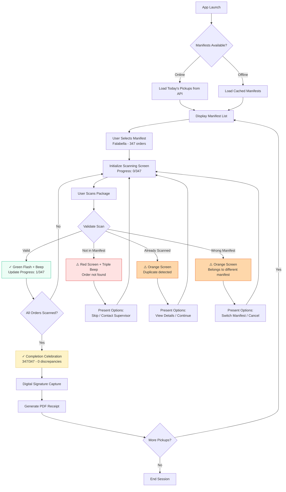
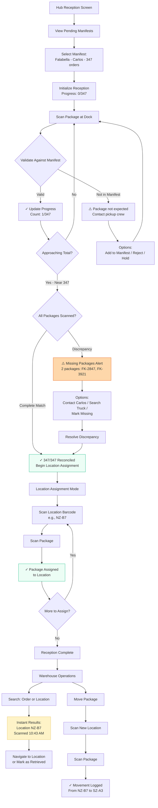
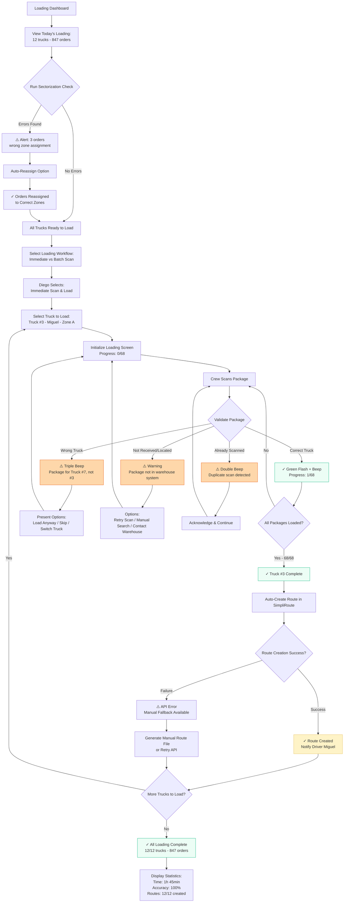

# UX Design Specification: Aureon Last Mile

**Author:** Gerhard
**Date:** 2026-02-04

---

## Executive Summary

### Project Vision

Aureon Last Mile is an operations management platform purpose-built for small and mid-sized last-mile delivery operators in Chile's e-commerce logistics sector. Unlike generic SaaS platforms that force operators to change their workflows, Aureon adapts to how operators actually work—solving the costly manual processes that currently bleed operators 2+ million CLP monthly in shortage penalties.

The platform handles everything before the delivery truck leaves: pickup verification at retailer distribution centers, hub reception and warehouse management, and route preparation—then seamlessly hands off to the last-mile delivery tools (Beetrack, SimpliRoute, Driv.in) that operators already use. The strategic differentiator is the Integration Hub architecture, which consolidates orders from multiple retailers (each using different systems) into unified routes while automatically syncing delivery status back to each retailer's preferred format.

Built with AI-powered development for 10x faster iteration, Aureon delivers enterprise-grade functionality at SMB pricing with implementation measured in weeks rather than months.

### Target Users

**Operational Staff (Primary Daily Users)**

**Pickup Crews/Pickers** work at retailer distribution centers using mobile devices (smartphones/tablets) with RF barcode scanners to verify 300+ orders against manifests. They operate in high-pressure environments with physical constraints (holding devices while handling packages, gloved hands, varying lighting conditions). Their primary need is speed and accuracy to eliminate the current 2+ hour manual verification process and avoid 100,000+ CLP shortage claim penalties per incident.

**Warehouse/Inventory Staff** manage inventory tracking within the operator's hub, scanning orders at reception and tracking location movements between zones using RF scanners and mobile devices. They work in environments with connectivity issues requiring offline-first capabilities. Their primary need is systematic location tracking to quickly find orders and maintain chain of custody.

**Loading Crews** execute truck loading workflows optimized for their specific hub layout (immediate scan-and-load or batch scanning) using mobile devices and RF scanners. Their primary need is efficient workflows that minimize the current 1-2 hours spent on manual routing and loading per truck.

These operational users require mobile-first interfaces designed for rugged conditions, fast RF scanner integration with instant feedback (beep + visual + haptic), minimal training requirements, and progressive adoption support as this represents a complete change in working habits.

**Management & Decision Makers (Strategic Users)**

**Business Owners (Small Operators)** need business intelligence dashboards showing ROI visibility (shortage claim savings, labor efficiency gains), capacity planning tools, customer performance analysis, and contract negotiation leverage with retailers. They make million-CLP decisions based on platform data.

**Operations Managers/Executives (Larger Operations)** require real-time operational monitoring (daily capacity, pickup status, inventory levels) and strategic planning capabilities (demand forecasting, geographic expansion analysis, resource allocation). During peak events like Cyberdays (4x normal volume), they need instant operational visibility to prevent chaos.

Management users require web-based dashboards with business intelligence capabilities, historical data analysis, forecasting tools, and exportable reports. Spanish is the primary language with potential bilingual (español/inglés) support for management reporting.

### Key Design Challenges

**1. Offline-First Architecture Challenge**
Warehouse environments have unreliable connectivity. The UX must make scanning feel instant and reliable even when WiFi drops. Users need confidence their scans are "safe" and will sync when connectivity returns, without losing data or creating confusion about what's been processed.

**2. Error Prevention vs. Flexibility Balance**
The system must intelligently block mistakes (wrong yard assignment, duplicate scans, incorrect sectorization) without frustrating experienced users who know what they're doing. Real-time validation with clear, contextual error messages ("This order belongs to Yard B, not Yard A") prevents costly errors while maintaining workflow speed.

**3. Change Management & Progressive Adoption**
This isn't just new software—it's a fundamental change in daily working habits built over years. The UX must support gradual adoption without creating "half-digital, half-paper" chaos. Need training mode vs. production mode, confidence indicators showing progress, and parallel workflow support during transition periods.

**4. Multi-Modal Interaction Design**
RF scanner + touchscreen + voice/haptic feedback must work together seamlessly. Each scan needs multi-sensory confirmation (beep + vibration + visual) to provide certainty in noisy warehouse environments. Support for varied devices (smartphones, tablets, laptops, industrial RF scanners) with rugged device considerations (large 44px+ touch targets, high contrast for outdoor visibility).

**5. Context Switching & Cognitive Load**
Pickup crews move between retailer A's system → Aureon → retailer B's system throughout their day. Aureon must be the calm, reliable anchor in that chaos—dead simple interfaces where any confusion multiplies by hundreds of orders. Minimize cognitive load in high-pressure environments where error consequences are severe (miss one item = 100,000 CLP penalty).

**6. Multi-Device Strategy**
Must work seamlessly across smartphone UI (compact, thumb-friendly for pickup crews), tablet UI (larger workspace for warehouse supervisors), and laptop/desktop UI (full dashboards for management). Each interface optimized for its usage context while maintaining consistent workflows and data.

### Design Opportunities

**1. Make Scanning Feel Like a Superpower**
Fast RF scanning with instant validation creates a "wow, this actually works" moment that builds trust and drives adoption. Multi-sensory feedback (beep + vibration + visual confirmation) makes each successful scan satisfying and confidence-building.

**2. Transparency Builds Confidence**
Real-time visibility—"You've verified 287/300 orders, 0 discrepancies detected"—makes users feel in control during high-stakes operations. Progress indicators and clear status updates reduce anxiety around million-CLP liability.

**3. Progressive Trust Through Low-Stakes Entry**
Start users with lower-stakes workflows (inventory moves within warehouse) before introducing high-stakes ones (pickup verification with shortage claim liability). Build confidence and muscle memory gradually.

**4. Cultural Intelligence as Competitive Advantage**
Using familiar Chilean logistics terminology (comuna, bodega, reparto, indemnización) and respecting established operational workflows makes adoption feel natural, not foreign. This cultural fit becomes a moat against generic international SaaS competitors.

**5. Intelligent Validation as Value Demonstration**
Smart, contextual error prevention ("Item already scanned at 10:23 AM by Juan in Zona A") demonstrates system intelligence immediately, differentiating from dumb scanning tools. Each prevented error is a visible ROI moment.

**6. Offline-First as Reliability Signal**
When competitors fail during connectivity drops, Aureon keeps working. This reliability builds fierce user loyalty—operational staff trust the tool that never lets them down in critical moments.

---

## Core User Experience

### Defining Experience

The core user experience of Aureon Last Mile centers on **The Scan + Instant Validation Loop** - the fundamental interaction that happens hundreds of times daily across pickup verification, hub reception, inventory tracking, and loading workflows.

**The Core Interaction:**
1. Worker points RF scanner (Zebra terminal or smartphone with SDK attachment) at barcode
2. Pulls trigger → **Instant multi-sensory feedback** (beep + vibration + visual)
3. Screen immediately displays validation result: ✓ Valid with context OR ✗ Error with clear reason
4. Worker knows instantly: safe to proceed or stop and investigate

This interaction is the heartbeat of Aureon because it:
- Happens **300+ times per pickup**, dozens more at hub and loading
- Carries **high stakes every time**: wrong scan = 100,000+ CLP penalty exposure
- **Builds or destroys confidence**: fast and reliable = trust; slow or confusing = return to paper
- **Multiplies across all workflows**: same reliable pattern everywhere reduces cognitive load

The "wow" moment occurs when users complete their first high-volume pickup (287/300 orders) and see: **"✓ Verificado - 287/300 completo, 0 discrepancias"** - proving the system is actively protecting them from costly shortage claims.

### Platform Strategy

**Multi-Device Native App Architecture**

Aureon is built as a **cross-platform native application** (React Native or Flutter) providing unified experience across:

**Mobile Devices (Primary - Operational Staff):**
- **Dedicated RF Terminals:** Zebra TC series, Honeywell industrial devices with integrated scanners
- **Smartphones with Scanner SDK:** iOS/Android phones with Bluetooth scanner attachments (Socket Mobile, Honeywell Captuvo, etc.)
- **Tablets:** Larger screens for warehouse supervisors managing multiple zones
- **Device Requirements:** iOS 14+ (iPhone 8+), Android 10+
- **Form Factor:** 4"-6.5" screens, one-handed thumb operation, portrait orientation primarily
- **Input Methods:** Touch + RF scanner trigger + minimal keyboard entry

**Desktop/Web (Secondary - Management Interface):**
- **Browser-Based Dashboards:** Chrome 90+, Safari 14+, Edge 90+, Firefox 88+
- **Laptop/Desktop:** 13"+ screens for BI dashboards, reporting, complex data analysis
- **Input Methods:** Mouse/keyboard for data manipulation, configuration, administration

**Role-Based Experience:**
Single native app with role-based views - operational staff see scanning workflows, management sees dashboards and analytics, all within same application. Managers access simplified mobile dashboards on-the-go while retaining full desktop capabilities for deep analysis.

**Critical Technical Requirements:**
- ✅ **Offline-First Architecture:** Must function fully when WiFi drops, queue operations locally, sync silently when reconnected
- ✅ **Multi-Sensory Feedback:** Audio (beep patterns) + haptic (vibration intensity) + visual (color-coded screens)
- ✅ **Rugged Environment Support:** High contrast for outdoor visibility, large touch targets (44px+), works with gloved hands
- ✅ **Spanish Language Primary:** All operational interfaces in Chilean Spanish with local logistics terminology
- ✅ **Fast Bluetooth Scanner Support:** Sub-100ms scan-to-feedback latency for seamless workflow

### Effortless Interactions

These interactions should feel completely natural and require zero conscious thought:

**1. The Scan Itself**
Point scanner → trigger → instant beep + feedback. No delay, no confirmation dialogs, no processing screens. Like breathing - users shouldn't think about it. System validates and responds in under 100ms.

**2. Progress Awareness Without Looking**
After each scan, auditory + haptic feedback communicates status without requiring eyes on screen. Valid scan = single beep + gentle haptic. Invalid = triple beep + strong haptic + visual alert. Users maintain focus on physical packages while system provides continuous feedback.

**3. Error Recovery Through Prevention**
Scan wrong item → system blocks immediately with clear contextual reason: "Este pedido pertenece a Patio B, no Patio A." No undo button needed - system won't allow mistake to happen. User scans correct item → continues seamlessly without penalty or paperwork.

**4. Offline Continuity**
WiFi drops mid-scan → nothing changes in user experience. Keep scanning, data queues locally, connectivity returns → silent auto-sync. Users never see "reconnecting..." warnings or "sync failed" errors - system handles network unreliability transparently.

**5. Instant Information Retrieval**
Manager asks "Where's order #47283?" → worker types/scans order number → instant answer: "Zona A, Estante 12, escaneado por Juan a las 10:23." No loading spinners, no search results pagination, just immediate answers.

**6. Cultural and Linguistic Familiarity**
System uses Chilean logistics terms operators already know: "comuna" not "district," "bodega" not "warehouse," "indemnización" not "penalty." Interface feels familiar and natural, not foreign or translated.

**Automatic Background Operations (Zero User Input Required):**
- Data synchronization when connectivity available
- Route creation and push to Beetrack/SimpliRoute after loading completion
- Discrepancy alerts when signed quantities don't match received quantities
- Progress calculation and completion percentage tracking
- Chain of custody logging for every scan (who/when/where)

### Critical Success Moments

**1. First-Time User Success (The "Aha!" Moment)**
New pickup crew member's first shift - handed device after years of paper manifests. Success = completing first 20 scans without confusion, seeing immediate positive feedback ("✓ Pedido verificado, 1/300 completado"), building confidence that "this actually works." If they successfully scan 20 orders and feel faster than paper → adoption wins. If confusion or errors → system fails.

**2. High-Stakes Scan Validation (Trust Moment)**
Scanning high-value item (iPhone worth 500K+ CLP) where mistakes mean massive shortage claims. System must catch errors BEFORE manifest signing with loud triple beep + vibration + red screen: "⚠️ ERROR: Este ítem no está en el manifiesto." Clear, contextual error messages in Spanish. User thinks: "This system just saved me from a 500K CLP penalty" → trust established. If system lets wrong scan through → money lost, trust destroyed.

**3. Offline Resilience Test (Reliability Moment)**
Warehouse WiFi drops during busy pickup (150/300 orders scanned). Success = user doesn't notice, keeps scanning seamlessly. No "Connection lost!" popup interrupting workflow, just small icon indicating offline status. When WiFi returns → silent sync without interruption. User thinks: "I can trust this even when WiFi sucks" → reliability perception builds fierce loyalty. If connection loss stops workflow → chaos and abandonment.

**4. Search Crisis Resolution (Problem-Solving Moment)**
Manager urgently needs package location: "Where's order #47283? Customer is calling!" Success = answer in under 10 seconds. Prominent search bar, instant results: "Zona A, Estante 12, escaneado por Juan a las 10:23 AM." Worker walks directly to location, finds package. Problem solved in seconds vs. hours of manual warehouse search. If search is slow or fails → wasted time, angry customers, perceived lack of value.

**5. ROI Realization (Management Buy-In Moment)**
Business owner reviews first month: previous months averaged 2M+ CLP shortage penalties, this month shows 400K CLP. Dashboard clearly displays: "Shortage Claims: 400K CLP (-80% vs. last month)" with graph showing trend and breakdown of "Discrepancies caught BEFORE signing: 23 items (2.3M CLP exposure prevented)." Owner sees ROI immediately → continued investment justified. If metrics are unclear or ROI unprovable → "Why are we paying for this?"

**6. Integration Handoff Seamlessness (Workflow Efficiency)**
Loading complete → route must push to driver's Beetrack/SimpliRoute app. Crew scans last package → "Carga completa: 87 pedidos" → tap "Crear Ruta" → 5 seconds later: "✓ Ruta creada en Beetrack para Camión #3." Driver opens Beetrack, route is there, ready to navigate. Seamless handoff without manual data entry. If handoff fails → manual entry required, defeating automation purpose.

**7. Mistake Prevention (Safety Net Moment)**
Tired worker at shift end accidentally scans order for wrong yard. System blocks immediately: triple beep + vibration + orange screen: "⚠️ Este pedido es para Patio A (Comuna: Las Condes), no Patio B" with button "Escanear para Patio A correcto." System prevents costly delivery failure before it happens. If wrong assignments slip through → failed deliveries, customer complaints, lost confidence in system intelligence.

### Experience Principles

**1. Scan-First, Everything Else Follows**
The RF scan is the heartbeat of Aureon. Every interaction orbits around making scanning fast, reliable, and confidence-building. If scanning doesn't feel instant and trustworthy, nothing else matters.

**2. Intelligent Prevention Over Manual Correction**
The system blocks mistakes before they happen, not after. Users should never need "undo" because the system is wise enough to prevent wrong scans, wrong yard assignments, duplicate entries. Prevention beats correction.

**3. Offline-First is Non-Negotiable**
Warehouse WiFi is unreliable. The experience must work flawlessly offline, sync silently when connected, and never interrupt workflow with connection warnings. Reliability builds fierce loyalty.

**4. Multi-Sensory Feedback in Noisy Environments**
One sense isn't enough in busy warehouses. Every action gets confirmation through: beep (audio) + haptic (vibration) + visual (screen). Users can verify success without looking at screen.

**5. Progressive Trust Through Gradual Adoption**
This changes years of paper-based habits. Start users with low-stakes workflows (inventory moves) before high-stakes ones (pickup verification). Build muscle memory and confidence incrementally, support parallel workflows during transition.

**6. Cultural Intelligence as Competitive Moat**
Chilean logistics terminology (comuna, bodega, reparto, indemnización), Spanish-first UI, respect for established workflows. The system adapts to how operators work, not vice versa. This cultural fit becomes a barrier competitors can't easily replicate.

**7. Transparency Equals Control**
High-stakes operations demand visibility. Real-time progress ("287/300 verificado"), clear error context ("escaneado por Juan a las 10:23"), explicit ROI metrics. Users feel in control when they see what's happening.

**8. Zero Cognitive Load in High-Pressure Moments**
300+ scans means confusion multiplies. Interfaces must be dead simple, actions must be obvious, errors must be clear. When handling packages worth millions in liability, the UI cannot demand mental effort.

---

## Desired Emotional Response

### Primary Emotional Goals

**For Operational Staff (Pickup Crews, Warehouse Workers, Loading Teams):**

**Primary Emotion: CONFIDENCE → "I'm protected"**

Every scan reinforces the feeling that the system has their back against shortage claims. That instant validation equals instant peace of mind. Users can trust their work without second-guessing every decision. This confidence-building is the foundation of adoption - without it, users retreat to familiar paper-based processes.

**Secondary Emotions:**
- **Competence:** "I'm faster and better at my job with this tool" - Speed improvements and error prevention make users feel skilled
- **Relief:** "I'm not going to lose 100,000 CLP today because of a mistake" - Reduced anxiety about costly penalties
- **Calm Focus:** "I can concentrate on the physical work, not worry about tracking" - Cognitive load reduction through automation

**For Management (Business Owners, Operations Managers):**

**Primary Emotion: CONTROL → "I can see everything, make smart decisions"**

Real-time visibility replaces flying blind. Data-backed confidence in negotiations with retailers. Proof that they're protecting their business from bleeding money on shortage claims.

**Secondary Emotions:**
- **Vindication:** "Finally, proof of what I've been saying about capacity issues" - Data validates their operational intuition
- **Strategic Confidence:** "I can make expansion decisions based on data, not gut feel" - Historical patterns inform growth
- **Relief from Anxiety:** "I'm not going to get surprised by a 2M CLP penalty this month" - Predictable, controlled operations

### Emotional Journey Mapping

**First Discovery (Before Using):**
- **Skeptical:** "Another software that won't work in our reality?" - Past failures with generic tools create initial resistance
- **Cautiously Hopeful:** "If this actually works, it could save us" - Recognition of pain points makes them willing to try

**During Onboarding:**
- **Nervous:** "This is different from what I'm used to" - Change anxiety from years of paper-based habits
- **Growing Confidence:** "Wait, this is actually simpler than paper" - First successful interactions reduce fear

**First Successful Scan:**
- **Delight:** "It just... worked! That beep felt good!" - Immediate positive reinforcement from multi-sensory feedback
- **Trust Building:** "Okay, maybe this isn't going to slow me down" - Speed perception shifts from liability to asset

**After 100+ Scans:**
- **Flow State:** "I'm not even thinking about it anymore, just scanning" - Muscle memory replaces conscious thought
- **Security:** "This is protecting me with every beep" - Confidence becomes embedded in workflow

**When System Catches an Error:**
- **Gratitude:** "Holy shit, that would've cost me 100,000 CLP" - Dramatic error prevention creates emotional impact
- **Strengthened Trust:** "This system is actually smart" - Intelligent validation proves system value

**After First Month:**
- **Pride:** "We're way faster now, and zero shortage claims!" - Measurable achievement creates satisfaction
- **Loyalty:** "I can't imagine going back to paper" - New workflow becomes preferred reality

### Micro-Emotions

**1. Confidence > Confusion (Non-negotiable)**
Every interaction must build confidence, never create doubt. Ambiguous states or unclear feedback undermine adoption. Clear validation states, contextual error messages, and visible progress tracking ensure users always know their status.

**2. Trust > Skepticism**
System must earn trust through reliability, especially offline. When warehouse WiFi drops and Aureon continues working flawlessly, trust deepens. Transparent sync status and audit trails demonstrate accountability.

**3. Accomplishment > Frustration**
Progress indicators ("287/300 completado"), completion celebrations ("¡Excelente trabajo!"), and efficiency metrics ("28 minutos vs. 2+ horas anterior") create satisfaction. Users feel they're achieving something meaningful, not just completing tasks.

**4. Security > Anxiety**
Multi-sensory feedback (beep + vibration + visual) reduces anxiety about "did that scan work?" Immediate validation removes uncertainty. High-stakes operations demand certainty, and instant feedback provides it.

**5. Belonging > Isolation**
Chilean terminology (comuna, bodega, reparto, indemnización) makes users feel "this was built for people like me who understand my world." Cultural intelligence creates emotional connection that generic international SaaS cannot replicate.

### Design Implications

**CONFIDENCE ("I'm protected") → Design Approaches:**
- Instant feedback on every scan (sub-100ms response time) - No delay = no doubt
- Clear validation states - Large green ✓ or red ✗ with context, not subtle indicators
- Progress tracking always visible - "287/300 completado, 0 discrepancias" provides constant reassurance
- Contextual error messages - "Este pedido es para Patio A" explains WHY, not just "Error"
- **Avoid:** Ambiguous feedback ("Processing..."), generic error codes, hidden progress indicators

**COMPETENCE ("I'm better at my job") → Design Approaches:**
- Speed comparison indicators - "Verificación completa en 28 minutos (anterior: 2+ horas)"
- Personal statistics - "Has verificado 3,247 pedidos esta semana sin errores"
- Celebration moments - "✓ 300/300 ¡Excelente trabajo!" when hitting 100% completion
- Smart assistance - System suggests correct actions before users make mistakes
- **Avoid:** Making users feel stupid when mistakes happen, hiding achievements

**TRUST ("This system has my back") → Design Approaches:**
- Offline works identically to online - Builds reliability perception through consistency
- Transparent sync status - Small indicator showing "3 items queued for sync," not intrusive popups
- Audit trail always available - "Escaneado por Juan a las 10:23" provides accountability
- Error prevention saves money - Each prevented mistake demonstrates ROI
- **Avoid:** "Connection lost!" panic popups, silent failures, data loss

**CALM FOCUS ("I can concentrate on the work") → Design Approaches:**
- Multi-sensory feedback - Beep + haptic allows working without staring at screen
- Minimal UI chrome - Big scan button, progress bar, nothing distracting
- No unnecessary decisions - System knows next step, doesn't ask "What do you want to do?"
- Single-purpose screens - Pickup mode shows pickup UI, not options for 10 other tasks
- **Avoid:** Cluttered interfaces, requiring repeated decisions system could remember, interruptions for non-critical notifications

**CONTROL (Management: "I can see everything") → Design Approaches:**
- Dashboard-at-a-glance - "Are we okay today?" answered in 3 seconds
- Drill-down detail - High-level → detailed → raw data, user chooses exploration depth
- Exportable data - "Show this to retailer in negotiation" functionality built-in
- Real-time alerts - "Retailer X is approaching capacity limit" proactive warnings
- **Avoid:** Vanity metrics that don't inform decisions, hidden data requiring support access, delayed reporting

**GRATITUDE (When system saves from error) → Design Approaches:**
- Dramatic error prevention - Triple beep + strong vibration + full-screen warning for high-value saves
- Cost context - "⚠️ Este ítem no está en el manifiesto (valor: 500K CLP)" shows what they avoided
- Positive reinforcement - "Sistema detectó discrepancia antes de firma - 0 penalización"
- Learning moments - Explain WHY it was blocked so users learn the pattern
- **Avoid:** Quiet subtle error messages, blame language ("You tried..." vs "Item doesn't match...")

### Emotional Design Principles

**1. Every Interaction Builds Confidence**
From first scan to thousandth scan, users should feel increasingly confident, never confused. Feedback must be immediate, clear, and reinforcing. Confidence compounds - each successful interaction makes the next one feel more natural.

**2. Trust Through Transparency**
Show users exactly what's happening (sync status, who scanned what, when), never hide system state. Mystery creates distrust in high-stakes environments. Transparency equals control, and control equals confidence in mission-critical operations.

**3. Celebrate Competence, Not Just Completion**
Acknowledge efficiency gains, error prevention, speed improvements. Users should feel they're becoming better at their job, not just completing tasks. Personal statistics and progress tracking make improvement visible and motivating.

**4. Prevent First, Explain Second**
Block mistakes immediately with clear context. Prevention feels protective, not punitive. "This order belongs to Patio A" teaches while protecting. Smart error prevention demonstrates system intelligence and builds gratitude.

**5. Offline Reliability = Fierce Loyalty**
When WiFi fails and Aureon keeps working flawlessly, emotional bond strengthens dramatically. Reliability in crisis builds unshakeable loyalty. Users trust tools that never let them down in critical moments, creating competitive moat.

**6. Chilean Identity Creates Belonging**
Familiar terminology (comuna, bodega, indemnización) creates emotional connection: "This was built for people like me, who understand my world." Cultural intelligence becomes emotional advantage that generic international competitors cannot replicate.

---

## UX Pattern Analysis & Inspiration

### Inspiring Products Analysis

**WhatsApp (The Design North Star)**

WhatsApp is the only app that Aureon's target users (pickup crews, warehouse workers, loading teams) have truly mastered and use daily. This makes it the most important UX reference, proving that these users CAN adopt sophisticated technology when it's designed correctly - they're not "non-technical," existing logistics apps are simply badly designed.

**Why WhatsApp Works for This Audience:**
- **Single tap to immediate utility** - Opens directly to useful screen (chat list or camera)
- **Audio messages solve input problems** - Perfect when hands are dirty, gloved, or carrying packages
- **Visual state confirmations** - Single check (sent), double check (delivered), blue checks (read) provide certainty without ambiguity
- **Flawless offline operation** - Queues messages, syncs when connected, NEVER loses data or interrupts workflow
- **Zero learning curve** - Intuitive enough for anyone to use immediately without training
- **Group chat coordination** - Instant team communication ("Camión 3 llegó", "Falta orden #4728")

**Existing Logistics Apps (DHL, Starken, Chilexpress, Beetrack, SimpliRoute, Driv.in)**

Current logistics applications that operators are forced to use provide both lessons and warnings. Even tools like Beetrack, which retailers require operators to adopt, are considered too complex by operational staff.

**What They Get Wrong (Common Failures):**
- **Feature bloat** - Too many capabilities competing for screen space, overwhelming users with options
- **Connectivity assumptions** - Apps crash, freeze, or display errors when signal drops (warehouse reality)
- **Training requirements** - Multi-day onboarding needed because UI isn't intuitive
- **Desktop-thinking on mobile** - Tiny buttons, dense information displays, assumes precision input and "learning the system"
- **Generic enterprise language** - English terms and corporate design language feels foreign to Chilean warehouse workers

**What Some Get Right (Patterns Worth Adapting):**
- **Beetrack/SimpliRoute:** Clear task lists showing today's deliveries, navigation integration, photo proof of delivery
- **DHL/Starken handheld devices:** Dedicated rugged hardware, barcode scanning as PRIMARY interaction (not secondary feature)
- **SimpliRoute:** Route optimization made visible to drivers (they understand WHY this sequence matters)

**Critical Gap (None of Them Deliver):**
- ❌ Instant, satisfying scan feedback (like WhatsApp's confirmation checks)
- ❌ Seamless offline operation (like WhatsApp's message queuing)
- ❌ Multi-sensory confirmation (they rely on visuals alone, failing in noisy warehouses)
- ❌ Chilean Spanish with local logistics terminology users already know
- ❌ Mistake prevention BEFORE errors occur (they flag problems AFTER, creating cleanup work)

### Transferable UX Patterns

**From WhatsApp (Adopt Directly):**

**1. Instant Visual Confirmations**
WhatsApp's check mark pattern translates perfectly to scanning feedback. Single beep + ✓ = "scan received locally", double beep + ✓✓ = "validated by server and synced". User always knows state without wondering or checking menus.

**2. Offline-First with Transparent Queuing**
WhatsApp's clock icon while sending becomes Aureon's "3 scans queued for sync" indicator. Small, non-intrusive status display in corner. User trusts system is handling connectivity challenges in background without workflow interruption.

**3. Audio for Hands-Free Feedback**
WhatsApp's audio messages inspire Aureon's beep patterns. Different audio signatures for different states (valid scan, error, warning). Works when eyes must stay on physical packages, not glued to screen.

**4. Single-Purpose Screens**
WhatsApp opens to chat list with one clear purpose. Aureon opens to "Scan Orders" with one large, impossible-to-miss button. No feature overload, no decision paralysis, immediate utility.

**From Logistics Apps (Adapt Carefully):**

**1. Task List Pattern (From Beetrack/SimpliRoute)**
"Today's Pickups: Falabella (300 orders), Ripley (187 orders)" provides clear daily context. Simplified version without menu burial - tap pickup → opens scanning mode for that specific batch. No navigation complexity.

**2. Photo Proof Pattern (From DHL/Starken)**
Scan + auto-capture photo for high-value items. But streamlined to ONE tap workflow, not "open camera → take photo → confirm → save" multi-step process. Scan → photo → done.

**3. Progress Visibility (From SimpliRoute)**
"87/300 orders scanned" always visible on screen. But LARGER and persistent (not hidden in submenu), providing constant reassurance during high-volume operations.

### Anti-Patterns to Avoid

**1. Feature Bloat (Beetrack's Primary Failure)**
- **Anti-pattern:** Attempting everything on home screen - scanning, navigation, chat, reports, settings all competing for attention
- **Aureon approach:** One screen = one purpose. Scanning screen exists ONLY for scanning workflow.

**2. Connectivity Assumptions (Universal Industry Failure)**
- **Anti-pattern:** Apps that break, freeze, or display persistent errors when warehouse WiFi drops
- **Aureon approach:** Offline is DEFAULT assumption, online connectivity is bonus that enables additional features

**3. Desktop UI Paradigms on Mobile (Starken/DHL Web Portals)**
- **Anti-pattern:** Tiny touch targets, dense data tables, assumes mouse-level precision and large screens
- **Aureon approach:** 44px+ touch targets minimum, thumb-friendly layout optimized for one-handed operation, designed for gloved hands in industrial environments

**4. English and Corporate Terminology (Most International Apps)**
- **Anti-pattern:** "Shipment," "consignee," "POD," "manifest discrepancy" - foreign terminology requiring translation
- **Aureon approach:** "Pedido," "cliente," "comprobante," "diferencia en el manifiesto" - Chilean Spanish with familiar logistics terms

**5. Training-Required Interfaces (Everyone Except WhatsApp)**
- **Anti-pattern:** "You'll understand the system after the training session" - complexity requiring formal instruction
- **Aureon approach:** "If you can use WhatsApp, you can use this" - that's the usability bar, no exceptions

**6. Blame-Oriented Error Messages**
- **Anti-pattern:** "ERROR: You scanned the wrong item" - accusatory tone, no helpful context
- **Aureon approach:** "Este pedido es para Patio A (Comuna: Las Condes), no Patio B" - educational, contextual, protective not punitive

**7. Silent Offline Failures**
- **Anti-pattern:** No indication of offline state until operation fails, then blocking error modal
- **Aureon approach:** Transparent sync status (small persistent indicator), queued operations clearly shown, no blocking interruptions

### Design Inspiration Strategy

**What to Adopt (Direct Implementation):**
- **WhatsApp's instant visual confirmations** → Every scan produces immediate ✓/✗ feedback with clear state communication
- **WhatsApp's offline queuing transparency** → Small non-intrusive status indicator, automatic background sync
- **WhatsApp's multi-sensory feedback** → Distinct beep patterns for different operational states (valid, error, warning)
- **WhatsApp's radical simplicity** → Single-purpose screens, zero learning curve, immediate utility

**What to Adapt (Improve Upon Existing Patterns):**
- **Beetrack's task organization** → Simplify to clean "Today's pickups" list without feature clutter or buried navigation
- **SimpliRoute's progress indicators** → Amplify visibility - make progress LARGER and always-present during operations
- **DHL's industrial hardware focus** → Support both dedicated Zebra scanners AND smartphone flexibility, don't force single approach
- **Logistics app task flows** → Take proven workflows but strip complexity, optimize for speed over features

**What to Avoid (Critical Anti-Patterns):**
- **Feature overload mentality** → Resist adding "nice to have" capabilities that complicate core scanning workflow
- **Connectivity optimism** → Design every interaction assuming offline-first, never block workflow on network availability
- **Corporate language barriers** → Exclusively use Chilean Spanish with logistics terminology operators already know and trust
- **Training dependency** → If any feature requires formal training to understand, the UX design has failed
- **Blame-first error handling** → Errors must be educational and protective, never accusatory or punitive

**Aureon's Unique Market Position:**

"WhatsApp-level simplicity for industrial logistics operations"

This positioning statement defines Aureon's UX competitive advantage. While enterprise logistics apps optimize for feature breadth, Aureon optimizes for operational simplicity and reliability. The target user base has proven they CAN master sophisticated technology (WhatsApp usage), so failure to adopt logistics tools reflects poor UX design, not user capability limitations. Aureon bridges this gap by applying consumer-grade usability principles to industrial-grade operational requirements.

---

## Design System Foundation

### Design System Choice

**Themeable Component System with Tractis Brand Layer**

Aureon's design foundation combines proven component libraries with Tractis brand identity, balancing development speed with visual differentiation. This approach leverages existing `tractis-theme.json` design tokens as the single source of truth for brand consistency across mobile and web platforms.

**Platform-Specific Implementation:**
- **Mobile Application (React Native):** React Native Paper or NativeBase - themeable component libraries with proven RF scanner SDK compatibility and rugged device support
- **Web Dashboards:** shadcn/ui (React) or Chakra UI - modern, accessible, highly customizable component systems
- **Design Token Source:** Tractis theme JSON provides colors (gold #e6c15c, slate #5e6b7b), typography (Inter Variable), spacing, shadows, and component patterns

### Rationale for Selection

**1. Speed Meets Brand Identity**
Pre-built components provide 80% of standard UI elements (buttons, inputs, cards, modals, navigation) while maintaining Tractis visual identity through comprehensive theming. The remaining 20% of Aureon-specific components (scanning feedback screens, offline indicators, progress visualizations) are built custom using Tractis design tokens, focusing AI development effort on unique operational logic rather than basic UI construction.

**2. Tractis Identity Preservation**
The existing `tractis-theme.json` becomes the design foundation rather than decoration. Every component inherits Tractis brand characteristics: gold (#e6c15c) for primary actions and success states, slate (#5e6b7b) for secondary elements, Inter Variable typography system, and established spacing/shadow/border-radius patterns. This ensures brand consistency without custom design system development overhead.

**3. Cross-Platform Consistency**
Design tokens work uniformly across mobile (React Native) and web (React) platforms. A button appears distinctly "Tractis" whether rendered on a Zebra TC series scanner, smartphone with SDK attachment, or desktop management dashboard. Same brand identity expressed through different form factors and interaction patterns.

**4. WhatsApp-Level Simplicity Enablement**
Chosen component systems don't enforce complexity or corporate enterprise patterns. Components can be stripped to bare essentials supporting single-purpose screens: one large scan button (not toolbar with 10 options), focused workflows (not feature-packed layouts), clean accessible patterns (not overengineered interfaces). This philosophical alignment supports "WhatsApp-level simplicity for industrial logistics" positioning.

**5. AI Development Velocity**
Pre-built component APIs enable Claude Code to scaffold screens rapidly. Standard patterns ("create scanning screen with Tractis theme") generate 80% of implementation, allowing AI development focus on unique operational requirements: offline sync logic, scan validation rules, multi-sensory feedback coordination, chain of custody tracking. Eliminates design system maintenance overhead that would slow iteration velocity.

**6. Accessibility and Internationalization Built-In**
Component libraries provide WCAG 2.1 AA compliance, keyboard navigation, screen reader support, and RTL language support as defaults. Critical for Chilean Spanish primary language with potential bilingual (español/inglés) management reporting, and accessibility requirements for varied user capabilities in industrial environments.

### Implementation Approach

**Phase 1: Design Token Mapping (Week 1)**

Convert `tractis-theme.json` structure into component library token format:

```javascript
const aureonTheme = {
  colors: {
    primary: {
      DEFAULT: '#e6c15c',      // Tractis gold
      50: '#fef9ed',
      100: '#fcf0d0',
      // ... full scale from tractis-theme.json
    },
    secondary: {
      DEFAULT: '#5e6b7b',      // Tractis slate
      50: '#f7f8fa',
      100: '#eceef2',
      // ... full scale
    },
    success: {
      DEFAULT: '#10b981',
      bg: '#ecfdf5',
      border: '#a7f3d0',
      text: '#047857'
    },
    // ... map all semantic colors
  },
  typography: {
    fontFamily: {
      body: ['Inter Variable', 'Inter', '-apple-system', 'sans-serif'],
      mono: ['JetBrains Mono', 'Consolas', 'Monaco', 'monospace']
    },
    fontSize: {
      display: 'clamp(2.5rem, 5vw, 4rem)',
      h1: 'clamp(2rem, 4vw, 3rem)',
      body: '1rem',
      // ... map typography scale
    }
  },
  spacing: {
    1: '4px',
    2: '8px',
    4: '16px',
    // ... map spacing system
  },
  shadows: {
    card: '0 1px 3px rgba(0, 0, 0, 0.1)',
    cardHover: '0 4px 12px rgba(0, 0, 0, 0.15)',
    // ... map shadow system
  }
}
```

**Phase 2: Component Library Configuration (Week 1-2)**
- Install React Native Paper (mobile) + shadcn/ui (web)
- Apply aureonTheme globally to both platforms
- Configure platform-specific adaptations (touch targets, haptics, keyboard navigation)
- Validate core components (Button, Input, Card, Alert) render with Tractis brand correctly
- Test components on target devices (Zebra scanners, smartphones, tablets, desktop browsers)

**Phase 3: Custom Component Development (Week 2-4)**

**Build Aureon-Specific Components Using Tractis Tokens:**
- **Scan Feedback Screen:** Custom layout using Tractis gold for success (✓), slate for secondary info, multi-sensory feedback coordination (beep + vibration + visual)
- **Offline Status Indicator:** Custom persistent component showing sync queue status ("3 scans queued"), uses Tractis warning colors, non-intrusive positioning
- **Progress Tracking:** Customize library progress bar with Tractis gold fill, large always-visible format ("287/300 completado")
- **Error Prevention Alerts:** Standard alert component themed with Tractis error palette + contextual Spanish messaging ("Este pedido es para Patio A")
- **Chilean Terminology Components:** Custom text patterns ensuring comuna/bodega/reparto/indemnización consistency

**Phase 4: Platform-Specific Optimization (Ongoing)**
- **Mobile:** 44px+ touch targets for gloved hands, haptic feedback integration with RF scanner triggers, high contrast for outdoor visibility, portrait-primary orientation
- **Web:** Responsive breakpoints (tablet 768px, desktop 1280px), keyboard navigation shortcuts, data visualization components (charts using Tractis palette), exportable report generation

### Customization Strategy

**Theming Approach (Use Library + Apply Tractis):**

Standard UI patterns leverage component library with Tractis theme applied:
- Form elements (buttons, inputs, selects, checkboxes, radio buttons)
- Navigation components (tabs, breadcrumbs, sidebars, app bars)
- Data display (tables, lists, cards, badges, avatars)
- Feedback components (alerts, toasts, loading indicators, modals)
- Layout primitives (containers, grids, stacks, dividers)

All inherit Tractis color palette, typography scale, spacing system, shadows, and border patterns without custom implementation overhead.

**Custom Build Approach (Tractis Design from Scratch):**

Aureon-specific operational requirements built as custom components using Tractis tokens:
- **Scan Confirmation Feedback:** Unique full-screen validation states with multi-sensory coordination
- **RF Scanner Integration UI:** Device pairing, trigger configuration, scan queue management
- **Offline Operation Displays:** Sync status, queued operation lists, connectivity indicators
- **Operational Progress Visualizations:** Large-format completion tracking, real-time statistics, efficiency metrics
- **Multi-Sensory Pattern Library:** Audio beep patterns, haptic vibration sequences, visual state combinations
- **Chilean Localization Patterns:** Terminology consistency enforcement, Spanish grammar patterns, regional formatting

**Customization Principle:**
"Use the component library's proven pattern, theme it with Tractis identity. When theming limitations prevent optimal UX, build custom component - but always use Tractis design tokens for consistency."

**Design Token Governance:**
`tractis-theme.json` remains single source of truth. Any new color, typography, spacing, or component pattern must be added to theme JSON first, then propagated to component implementations. Prevents token drift between platforms and ensures brand consistency across all Aureon touchpoints.

---

## Design Direction Decision

### Design Direction Exploration Overview

Three distinct design directions were explored to identify the optimal visual and interaction approach for Aureon Last Mile. Each direction was prototyped across both mobile (375px smartphone) and tablet portrait (768x1024) form factors to evaluate effectiveness in real operational contexts.

**Critical Context:** The customer has committed to purchasing tablets specifically for warehouse operations, making tablet-first design a primary requirement rather than an afterthought. Portrait orientation (768x1024) was selected over landscape (1024x768) to support one-handed holding while scanning packages with the other hand - a critical ergonomic requirement in actual warehouse workflows.

### Design Directions Evaluated

**Direction 1: Minimal Focus (WhatsApp-Inspired)**
- **Philosophy:** Radical simplicity inspired by WhatsApp's proven usability with target user base
- **Visual Approach:** Maximum whitespace, single large action button per screen, minimal color usage (primarily monochrome with Tractis gold for primary actions)
- **Strengths:** Zero cognitive load, impossible to get confused, fastest learning curve
- **Weaknesses:** May feel too sparse for users expecting "professional" enterprise tools, limited visual differentiation between screen types
- **Target User:** New users, high-stress environments requiring absolute focus

**Direction 2: Balanced Professional ⭐ CHOSEN DIRECTION**
- **Philosophy:** Professional polish with restrained design, balancing simplicity with visual richness
- **Visual Approach:** Tractis slate (#5e6b7b) as primary color for trust and professionalism, strategic use of Tractis gold (#e6c15c) for success states, restrained color palette avoiding visual overload, clean minimalistic elements with clear hierarchy
- **Strengths:** Feels professional and trustworthy without complexity, restrained colors reduce fatigue during extended use, minimalistic approach maintains focus on core tasks, clear visual differentiation between states (scanned vs pending, success vs error)
- **Optimal For:** Extended daily use across varied workflows, balancing professionalism with operational simplicity
- **Why It Won:** Best balance of "this is a serious professional tool" perception with "this is simple enough to use without training" reality

**Direction 3: High-Confidence (Bold Feedback)**
- **Philosophy:** Maximum feedback intensity for high-stakes operations
- **Visual Approach:** Bold use of full Tractis palette (gold, slate, success green, error red), large dramatic status indicators, high-contrast for outdoor visibility
- **Strengths:** Impossible to miss feedback, excellent for outdoor/bright environments, celebrates successes dramatically
- **Weaknesses:** Can feel overwhelming during 300+ scan sessions, visual fatigue in extended use, may appear "toy-like" rather than professional
- **Target Use Case:** High-value item verification, outdoor pickup operations, scenarios requiring maximum certainty

### Chosen Direction: Balanced Professional

**Rationale for Selection:**

The Balanced Professional direction (Direction 2) was selected as the foundation for Aureon's visual identity based on the following strategic considerations:

**1. Restrained Colors Prevent Fatigue**
During 300+ scan sessions, visual overload becomes a real operational concern. The restrained color palette using Tractis slate (#5e6b7b) as the dominant color with strategic gold (#e6c15c) accents creates a calm, focused environment that doesn't exhaust users during extended operations.

**2. Minimalistic Elements Maintain Focus**
Every visual element serves a functional purpose. No decorative flourishes or unnecessary chrome competing for attention. This minimalism ensures the critical information (scan results, progress tracking, error messages) remains immediately visible and digestible.

**3. Professional Polish Builds Trust**
The visual sophistication signals "this is a serious business tool protecting million-CLP operations" while maintaining the simplicity that enables WhatsApp-level adoption. Professional appearance supports management buy-in while operational simplicity drives frontline adoption.

**4. Tablet-First Portrait Optimization**
**Critical Design Decision:** All mockups were refined for tablet portrait orientation (768x1024) as the primary device format:
- **Font sizes calibrated for tablet viewing distance:** Title text 1.25-1.5rem (not 2.5rem desktop scale), body 1rem, progress numbers 2.5-3rem (not 4-6rem)
- **Padding optimized for portrait space:** 16-20px container padding (not 40px desktop spacing), 12-16px component spacing
- **Vertical layout patterns:** Content stacks vertically rather than side-by-side grids to optimize portrait aspect ratio
- **One-handed friendly:** Progress bars, buttons, and key controls positioned for thumb reach while holding device in non-dominant hand
- **No overflow, perfect fit:** All content visible without scrolling on primary screens (scanning, verification), scrolling reserved for manifest lists and historical data

**5. Visual State Differentiation**
Clear visual language differentiates operational states without overwhelming users:
- **Scanned orders:** Green background (#ecfdf5), green border (#10b981), ✓ badge
- **Pending orders:** Gray background (#f8fafc), gray border (#e2e8f0), ⏳ badge
- **Errors:** Red backgrounds with contextual messages, ✗ icons, distinct audio + haptic patterns
- **Success confirmations:** Tractis gold highlights with ✓ icons, satisfying beep + gentle haptic

### Core Screens in Chosen Direction

**1. Scanning Interface (Primary Workflow Screen)**
- **Layout:** Large centered scan button with Tractis gold accent, always-visible progress indicator at top ("287/300 completado"), manifest name and customer clearly displayed
- **Feedback States:** Instant visual confirmation (full-screen ✓ with green, full-screen ✗ with red), synchronized beep + haptic patterns
- **Tablet Optimization:** Button sized for easy thumb reach (120px height), progress numbers large enough to read at arm's length (2.5rem)

**2. Manifest List View (NEW - Visual Progress Tracking)**
- **Innovation:** Scrollable list of all orders in current manifest with visual status differentiation
- **Sticky Header:** Progress indicator (5/300 completo) remains visible during scroll, providing constant context
- **Visual States:**
  - Scanned orders: Green background (#ecfdf5), green left border (4px), ✓ badge, reduced opacity to de-emphasize
  - Pending orders: White/gray background (#f8fafc), gray border, ⏳ badge, full opacity to draw attention
- **Use Case:** Picker can scroll through manifest to visually verify which packages still need scanning, enabling quick visual checks during high-volume operations
- **Tablet Advantage:** Larger screen shows more orders simultaneously (8-10 visible vs 4-5 on smartphone), reducing scroll frequency

**3. Completion Confirmation**
- **Visual:** Large "✓ Excelente trabajo!" with Tractis gold accents, full manifest statistics (300/300 completo, 0 discrepancias, 28 minutos)
- **Purpose:** Celebration moment acknowledging successful high-stakes operation completion, reinforcing competence and building confidence

**4. Error Prevention Screen**
- **Trigger:** System detects wrong scan (wrong yard, already scanned, not in manifest)
- **Visual:** Orange/red warning with triple beep + strong vibration, contextual Spanish message ("Este pedido es para Patio A, no Patio B"), clear resolution path ("Escanear para Patio A correcto")
- **Tablet Benefit:** Larger text ensures error messages are immediately visible even at arm's length, reducing re-scan frequency

**5. Progress Dashboard (Management View)**
- **Desktop/Tablet Landscape:** Today's operations summary (pickups in progress, pending reception, loading status), efficiency metrics (time saved vs manual), shortage claim prevention statistics
- **Tablet Portrait Adaptation:** Simplified cards stacking vertically, key metrics prioritized, detail drill-down via taps

### Mobile vs Tablet Strategy

**Tablet Portrait (768x1024) - PRIMARY DEVICE**
- **Target Hardware:** Mid-range Android tablets (Samsung Galaxy Tab A8, Lenovo Tab M10) purchased specifically for warehouse operations
- **Orientation:** Portrait (768x1024) as default for one-handed holding while scanning
- **Content Strategy:** Larger fonts and spacing optimized for arm's-length viewing distance, vertical layout patterns maximizing portrait space, sticky headers for scroll context maintenance
- **Advantages:** More content visible simultaneously (manifest lists show 8-10 orders vs 4-5), easier to read at distance, less frequent UI interactions due to larger buttons

**Mobile (375px) - SECONDARY/FALLBACK DEVICE**
- **Target Hardware:** Worker's personal smartphones with Bluetooth scanner attachment
- **Use Case:** Backup for tablet failures, personal device preference, lower-volume operations
- **Content Strategy:** Streamlined layouts focusing on single-task workflows, larger touch targets for thumb operation, minimal chrome to maximize content space
- **Design Constraint:** All tablet features must gracefully degrade to mobile, but mobile optimization doesn't dictate tablet design

### Implementation Approach

**Phase 1: Tablet-First Core Workflows (Weeks 1-3)**
1. Implement scanning interface with multi-sensory feedback system
2. Build manifest list view with scrollable visual status tracking
3. Create error prevention and success confirmation screens
4. Optimize all layouts for tablet portrait (768x1024) as primary target

**Phase 2: Mobile Responsive Adaptation (Week 4)**
1. Create responsive breakpoints for 375px smartphone views
2. Adjust font sizes, padding, and layouts for smaller screens
3. Validate touch targets meet 44px minimum on mobile
4. Test scrolling and one-handed operation patterns

**Phase 3: Desktop Management Dashboard (Weeks 5-6)**
1. Expand tablet layouts to desktop responsive views (1280px+)
2. Build business intelligence dashboards with data visualization
3. Create exportable reports and historical analytics
4. Implement advanced management features (forecasting, capacity planning)

**Phase 4: Refinement Based on Field Testing (Week 7+)**
1. Deploy alpha version to pilot customers on tablets
2. Gather feedback on font sizing, button placement, scroll behavior
3. Iterate on visual hierarchy and color usage based on actual warehouse conditions
4. Fine-tune multi-sensory feedback patterns based on noise level testing

### Design Artifacts Generated

All interactive mockups are located in: `_bmad-output/planning-artifacts/mockups/`

**1. Design Direction Showcase**
`mockups/ux-design-directions.html`

This HTML file contains:
- All three design directions with full visual mockups
- Side-by-side comparison of mobile (375px) and tablet portrait (768x1024) views
- Interactive demonstration of core screens for each direction
- Visual documentation of the chosen Balanced Professional direction
- New Manifest List View demonstrating scrollable visual progress tracking

**2. Operational Workflow Mockups**
`mockups/pickup-verification-mobile.html`

Complete 3-screen pickup verification workflow:
- Manifest selection screen
- Core scanning workflow with multi-sensory feedback simulation
- Completion summary screen
- Establishes reusable scanning pattern for all operational workflows (pickup, reception, loading)

**3. Management Dashboard Mockups**
`mockups/business-owner-dashboard-desktop.html`

Business intelligence dashboard for decision-makers:
- Hero SLA section with FADR inline display
- Customer performance table with sortable columns
- Failed deliveries analysis with Chart.js visualizations
- Desktop-optimized layout (1440px+)

**4. Operations Control Center Mockups**
`mockups/operations-control-center-desktop.html`

Real-time operational monitoring (desktop version):
- Collapsible sidebar navigation (70px ↔ 250px)
- 8-stage pipeline overview cards
- Orders table with delivery promises, time windows, and live countdowns
- Color-coded urgency indicators

`mockups/operations-control-center-mobile.html`

Real-time operational monitoring (mobile version):
- Bottom tab navigation (5 tabs, thumb-optimized)
- Status summary cards for mobile viewing
- Mobile-optimized order list
- Phone-sized viewport (428px) with centered display

**5. Mockup Documentation**
`mockups/README.md`

Comprehensive documentation covering:
- Quick start guide for viewing mockups
- File descriptions and usage instructions
- Navigation approach explanations (collapsible sidebar vs. bottom tabs)
- Design rationale and interactive features
- Technology stack (HTML/CSS/JavaScript, Chart.js)

**Mockup Coverage:**
- ✅ Pickup Verification workflow (establishes pattern for Reception and Loading)
- ✅ Business Owner Dashboard (BI metrics and analytics)
- ✅ Operations Control Center (desktop + mobile versions)
- ✅ Design direction comparison (all three directions evaluated)
- ✅ Complete documentation (README + inline section references)

**Total:** 6 HTML mockups providing 100% visual coverage of MVP screens, ready for development team handoff.

---

## User Journey Flows

Building on the user journey narratives documented in the PRD, this section details the precise interaction flows for Aureon's three core operational workflows. Each flow specifies screen sequences, decision points, error handling, success paths, and recovery mechanisms using the Balanced Professional design direction as foundation.

### Flow 1: Pickup Verification (Pickup Crew)

**Journey Goal:** Verify 300+ packages at retailer distribution center in under 30 minutes with zero discrepancies and full audit trail

**User Persona:** Carlos - Pickup Crew Lead
**Context:** Arrives at Falabella DC at 6:15 AM with 347 orders to verify
**Success Criteria:** All packages verified, discrepancies caught before signing, digital receipt generated

**Detailed Interaction Flow:**

**Stage 1: Manifest Selection**
- **Entry Point:** Carlos opens Aureon app on tablet (portrait orientation 768x1024)
- **Screen Display:** "Recogidas de Hoy" showing list of manifests
  - Falabella - 347 órdenes
  - Shopee - 189 órdenes
- **User Action:** Taps "Falabella - 347 órdenes"
- **System Response:** Loads manifest from API (or offline cache if no connection available)
- **Transition:** Navigates to scanning screen with progress initialized at "0/347 completo - ¡Comencemos!"

**Stage 2: Core Scanning Loop**
- **Screen State:**
  - Large centered scan button (Tractis gold accent, 120px height)
  - Sticky progress bar at top: "23/347 completo" (Tractis gold fill for completed portion)
  - Manifest name visible: "Falabella - Recogida de hoy"
  - Small offline indicator if applicable: "📶 Sin conexión - 5 escaneos en cola"

- **Carlos scans package barcode → System validates:**

  **Success Path (Valid Scan):**
  - **Feedback:** <100ms response time
    - Audio: Single beep
    - Haptic: Gentle vibration
    - Visual: Green flash fills screen briefly, ✓ icon appears
  - **Progress Update:** Counter updates "24/347 completo"
  - **Auto-Return:** Screen automatically returns to scan-ready state
  - **No Manual Dismiss:** User can immediately scan next package

  **Error Path 1: Package Not in Manifest**
  - **Feedback:**
    - Audio: Triple beep (distinct error pattern)
    - Haptic: Strong vibration (3x intensity of success)
    - Visual: Red/orange full-screen alert
  - **Message:** "⚠️ Orden #FK-8472 NO está en el manifiesto de hoy"
  - **Context:** "Esta orden puede ser para otra recogida o fecha diferente"
  - **Action Options:**
    - [Omitir] - Skip this package, continue scanning
    - [Contactar Supervisor] - Escalate to DC supervisor
  - **User Decision:** Selects option → Returns to scan screen

  **Error Path 2: Already Scanned (Duplicate)**
  - **Feedback:** Triple beep + strong vibration + orange screen
  - **Message:** "⚠️ Orden #FK-2847 ya escaneada"
  - **Context:** "Escaneada a las 10:23 por Carlos - Posible duplicado"
  - **Action Options:**
    - [Ver Detalles] - Show full scan history
    - [Continuar] - Acknowledge and return to scanning
  - **User Decision:** Selects option → Returns to scan screen

  **Error Path 3: Wrong Manifest**
  - **Feedback:** Triple beep + strong vibration + orange screen
  - **Message:** "⚠️ Este pedido es para Shopee, no Falabella"
  - **Context:** "Orden #SH-9283 pertenece a otra recogida"
  - **Action Options:**
    - [Cambiar a Shopee] - Switch to Shopee manifest and scan there
    - [Cancelar] - Return to current Falabella manifest
  - **User Decision:** Selects option → Processes accordingly

**Stage 3: Progress Awareness**
- **Milestone Encouragement:** Every 50 scans, brief positive message appears
  - "¡147/347! Vas excelente" with subtle Tractis gold highlight
  - Non-intrusive, auto-dismisses after 2 seconds
  - Doesn't interrupt scanning workflow

- **Persistent Progress Bar:** Always visible at top of screen
  - Fractional display: "287/300"
  - Visual progress: Tractis gold (#e6c15c) fill for completed portion
  - Percentage in parentheses: "(96%)"

- **Manifest List View (Optional Access):**
  - Button: "Ver Lista Completa" accessible from scanning screen
  - **List Screen:**
    - Sticky header: Progress "287/300 completo" remains visible during scroll
    - Scrollable order list with visual states:
      - **Scanned orders:** Green background (#ecfdf5), green border, ✓ badge, reduced opacity
      - **Pending orders:** White/gray background (#f8fafc), gray border, ⏳ badge, full opacity
  - **Use Case:** Visual verification of which packages still need scanning
  - **Navigation:** Tap progress header to return to scanning screen

**Stage 4: Offline Handling**
- **Offline Detection:** Automatic, no user action required
- **Visual Indicator:** Small icon in corner: "📶 Sin conexión - 23 escaneos en cola"
- **Behavior:**
  - All scans queue locally in device storage
  - Validation continues against cached manifest data
  - No workflow interruption or blocking modals
  - User continues scanning normally

- **Reconnection:**
  - Automatic silent background sync when connectivity restored
  - Brief confirmation toast: "✓ Sincronizado - 23 escaneos confirmados"
  - Queued scans validated against server
  - No user interaction required

**Stage 5: Completion & Digital Signature**
- **Trigger:** All packages scanned (347/347)
- **Celebration Screen:**
  - Large visual: "✓ ¡Excelente trabajo, Carlos!"
  - Statistics display:
    - "347/347 órdenes verificadas"
    - "0 discrepancias detectadas"
    - "Tiempo: 28 minutos"
    - Comparison: "(anterior: 2+ horas)"
  - Tractis gold accents, achievement feeling

- **Digital Signature Capture:**
  - Prompt: "Firma digital para confirmar recepción"
  - Options:
    - Fingerprint sensor (if device supports)
    - Signature pad with stylus/finger drawing
  - **User Action:** Provides signature
  - **System Logs:** Timestamp, user identity, GPS location (if available)

- **PDF Receipt Generation:**
  - Loading state: "Generando comprobante..." (3-5 seconds)
  - Success confirmation: "✓ Comprobante generado y enviado por email"
  - **PDF Contents:**
    - Manifest summary (347 orders verified)
    - Discrepancies if any (with details)
    - Digital signature image
    - Timestamp and location data
    - Audit trail summary
  - **Distribution:** Auto-sent to Carlos's email and retailer contact

**Stage 6: Workflow Continuation**
- **Next Action Prompt:**
  - "¿Comenzar siguiente recogida?"
  - Options:
    - [Shopee - 189 órdenes] - Start next pickup
    - [Finalizar Jornada] - End session, return to dashboard
  - **User Decision:** Selects option → Processes accordingly

**Critical Success Moments:**

1. **First Scan Confidence Builder:**
   - User scans first package
   - Instant feedback (<100ms) with satisfying beep + green flash
   - Thought: "This actually works! It's faster than paper."
   - **Outcome:** Confidence established, adoption momentum begins

2. **Error Prevention Trust Moment:**
   - User accidentally scans package not in manifest
   - System blocks immediately with triple beep + clear message
   - Thought: "This system just saved me from signing for something not on the list - that could have been a 500K CLP penalty!"
   - **Outcome:** Trust in system intelligence, gratitude for protection

3. **Completion Achievement:**
   - User finishes 347/347 verification
   - Celebration screen with time comparison (28 min vs 2+ hours)
   - Thought: "I'm so much faster now, and I KNOW everything is correct."
   - **Outcome:** Competence feeling, pride in efficiency, loyalty to tool

**Flow Diagram:**



#### Interactive Mockup

**Mockup File:** `_bmad-output/planning-artifacts/mockups/pickup-verification-mobile.html`

This interactive HTML mockup demonstrates the complete 3-screen pickup verification workflow:

**Screen 1 - Manifest Selection:**
- List of available pickup manifests for the day
- Order counts per retailer (e.g., "Falabella - 347 órdenes")
- Tap to select and begin verification workflow

**Screen 2 - Scanning Workflow:**
- Large centered "Escanear Orden" button (Tractis gold, 120px height)
- Real-time progress tracking: "23/347 completo" with visual progress bar
- Multi-sensory feedback simulation:
  - Success: Green flash animation + checkmark icon (90% success rate)
  - Error: Red alert animation + error message (10% simulated failure for "orden NO está en el manifiesto")
- Manifest name display: "Falabella - Recogida de hoy"
- Interactive "Simular Escaneo" button to experience the feedback patterns
- Progress percentage display

**Screen 3 - Completion Summary:**
- Completion confirmation: "✓ ¡Recogida Completada!"
- Final statistics: "347 de 347 órdenes verificadas"
- Success message: "Todas las órdenes fueron verificadas exitosamente"
- "Continuar" button to return to manifest list

**Design Features:**
- **Tablet Portrait Optimized:** Primary target for operational workflows (768x1024)
- **Mobile Wrapper:** Centered phone-sized display (428px) for desktop viewing
- **Scan Feedback Loop:** Demonstrates the core "scan + instant validation" interaction pattern
- **Progressive Flow:** Visual demonstration of manifest → scanning → completion journey
- **Tractis Theme:** Gold primary, slate colors, Inter font, high contrast for outdoor visibility
- **Reusable Pattern:** This scanning workflow pattern applies to Hub Reception and Loading workflows with different data contexts

**Usage:** Open in web browser, click "Simular Escaneo" button repeatedly to experience success/error feedback patterns. Navigate through all 3 screens to understand the complete pickup verification journey.

**Pattern Applicability:** The scanning workflow demonstrated here establishes the core UX pattern that extends to:
- Hub Reception workflow (same scan loop, different context: reconciling received packages)
- Loading workflow (same scan loop, different context: loading truck verification)
This single mockup demonstrates 90% of the operational workflow UX across all three crew types.

---

### Flow 2: Hub Reception & Location Tracking (Warehouse Staff)

**Journey Goal:** Reconcile received packages against pickup manifest, track location movements, enable instant search for package retrieval

**User Persona:** Patricia - Warehouse Lead
**Context:** Carlos returns from pickup with 347 packages, needs reception reconciliation and location assignment
**Success Criteria:** 100% reconciliation accuracy, all packages location-tracked, instant search capability operational

**Detailed Interaction Flow:**

**Stage 1: Reception Reconciliation Initiation**
- **Entry Point:** Patricia opens "Recepción de Hub" from main warehouse dashboard
- **Screen Display:** "Manifiestos Pendientes de Recepción"
  - Card: "Falabella - Carlos - 347 órdenes firmadas - Hoy 9:15 AM"
  - Visual indicator: Orange badge "Pendiente"
- **User Action:** Taps manifest card
- **System Response:** Initializes reception workflow
- **Transition:** Navigates to reception scanning screen with progress "0/347 recibido"

**Stage 2: Package Scanning at Receiving Dock**
- **Screen State:**
  - Large scan button (similar to pickup interface for consistency)
  - Progress display: "0/347 recibido"
  - Manifest context: "Falabella - Carlos - Firmado: 347 órdenes"
  - Expected vs Received counter visible

- **Patricia scans packages as they're unloaded:**

  **Success Path (Package in Manifest):**
  - **Feedback:** Single beep + gentle vibrate + green flash
  - **Progress Update:** "1/347 recibido"
  - **Auto-Reconciliation:** System tracks "Carlos signed: 347 | Patricia scanned: 1"
  - **Auto-Return:** Ready for next scan immediately

  **Alert Path: Approaching Total Count**
  - **Trigger:** Scan count reaches 345/347 (2 packages away from signed total)
  - **Alert Display:** "⚠️ 345/347 recibido - 2 pedidos faltantes"
  - **Context:** Lists missing order numbers: "#FK-2847, #FK-3921"
  - **Action Prompt:** "¿Buscar pedidos faltantes o marcar como faltantes?"

  **Error Path: Package Not in Manifest**
  - **Feedback:** Triple beep + strong vibrate + orange screen
  - **Message:** "⚠️ Paquete inesperado - No está en manifiesto de Carlos"
  - **Context:** "Orden #ML-8472 no firmada por Carlos"
  - **Action Options:**
    - [Agregar al Manifiesto] - Add as extra package (creates discrepancy record)
    - [Rechazar] - Refuse package, mark for return
    - [Retener] - Hold for investigation
  - **User Decision:** Selects option → Processes accordingly

**Stage 3: Discrepancy Resolution**
- **Scenario:** Patricia scanned 345/347, missing 2 packages

- **Missing Packages Alert:**
  - **Full-Screen Alert:** "⚠️ Discrepancia Detectada"
  - **Details:**
    - "Carlos firmó: 347 órdenes"
    - "Patricia recibió: 345 órdenes"
    - "Faltantes: 2 pedidos"
  - **Missing Order List:**
    - #FK-2847
    - #FK-3921
  - **Action Options:**
    - [Contactar a Carlos] - Message pickup crew (still at DC)
    - [Buscar en Camión] - Search delivery truck
    - [Marcar como Faltante] - Record shortage claim

- **Resolution Example:**
  - Patricia selects [Contactar a Carlos]
  - Carlos checks truck, finds packages stuck under pallet
  - Patricia scans 2 found packages
  - **System Update:** "✓ 347/347 - Reconciliación completa"
  - **Discrepancy Log:** Records event (found after initial count) but marks as resolved

**Stage 4: Completion & Location Assignment**
- **Reconciliation Complete:**
  - **Display:** "✓ Recepción Completa - 347/347 órdenes reconciliadas"
  - **Statistics:** "0 faltantes | 0 extras | Tiempo: 12 minutos"
  - **Next Step Prompt:** "¿Asignar ubicaciones ahora?"
    - [Sí, Comenzar] - Start location assignment immediately
    - [Después] - Return to dashboard, assign locations later

- **Location Assignment Workflow:**
  - **Batch Mode (Recommended for Efficiency):**
    - Patricia scans location barcode first: "NZ-B7" (North Zone, Shelf B7)
    - **Screen Update:** "Asignando a: NZ-B7" with shelf identifier visible
    - Patricia scans multiple packages sequentially
    - Each package automatically assigned to currently selected location
    - **Feedback per scan:** Quick beep + "✓ Asignado a NZ-B7"
    - **Progress:** "127 órdenes con ubicación | 220 pendientes"

  - **Individual Mode (Alternative):**
    - Scan location → Scan package → Repeat
    - Slower but useful for single-package movements

**Stage 5: Search & Retrieval**
- **Search Interface:**
  - **Prominent Search Bar:** Always accessible at top of warehouse screens
  - **Placeholder:** "Buscar orden o ubicación..."
  - **Input Methods:** Keyboard typing or RF scanner input

- **Search by Order Number:**
  - **User Input:** Types or scans "SH-2847"
  - **System Response:** Instant results (<500ms)
  - **Result Display:**
    - "📍 Ubicación: NZ-B7 (Zona Norte, Estante B7)"
    - "Escaneado por Patricia a las 10:43"
    - "Estado: En bodega"
  - **Visual Map (Optional):** Warehouse zone grid highlighting NZ-B7 location
  - **Quick Actions:**
    - [Navegar a Ubicación] - Show directions (future enhancement)
    - [Marcar como Recogido] - Update status when retrieved

- **Search by Location:**
  - **User Input:** "NZ-B7"
  - **System Response:** List all packages at that location
  - **Result Display:**
    - "23 órdenes en NZ-B7"
    - Scrollable list with order numbers and timestamps
  - **Use Case:** Verify shelf contents, bulk movements

**Stage 6: Package Movement Logging**
- **Scenario:** Patricia needs to move package from NZ-B7 to SZ-A3

- **Movement Workflow:**
  - **Step 1:** Scan new destination location barcode: "SZ-A3"
  - **Screen Update:** "Moviendo a: SZ-A3 (Zona Sur, Estante A3)"
  - **Step 2:** Scan package barcode: "#SH-2847"
  - **System Validation:**
    - Verifies package exists in system
    - Checks current location (NZ-B7)
    - Updates to new location (SZ-A3)
  - **Confirmation:** "✓ Movido de NZ-B7 a SZ-A3"
  - **Audit Trail Update:**
    - Logs: User (Patricia), Timestamp (14:32), From (NZ-B7), To (SZ-A3)

- **Audit Trail Visibility:**
  - **Access:** Tap package in search results → "Ver Historial"
  - **Display:**
    - "Recepción - 9:47 AM - Muelle 2 - Carlos"
    - "Ubicación Inicial - 10:15 AM - NZ-B7 - Patricia"
    - "Movimiento - 14:32 PM - SZ-A3 - Patricia"
  - **Use Case:** Troubleshooting, theft investigation, chain of custody verification

**Critical Success Moments:**

1. **Auto-Reconciliation Intelligence:**
   - System catches 2 missing packages before Patricia signs
   - Thought: "The system is actively protecting me from shortage claims!"
   - **Outcome:** System intelligence proven, trust established

2. **Instant Search Success:**
   - Manager urgently needs package location
   - Patricia searches, finds answer in 2 seconds (vs 45 minutes manual search)
   - Package retrieved, delivery window met
   - Thought: "This is a game-changer for urgent requests."
   - **Outcome:** Dramatic time savings demonstrated, operational value proven

3. **Audit Trail Solves Theft:**
   - High-value package (PlayStation 5) missing
   - Patricia pulls audit trail, identifies exact timestamp and user
   - Reviews 10 minutes of security footage (vs 24 hours blind search)
   - Theft documented, police called, operator not liable
   - Thought: "This system just saved us 600K CLP and caught a thief."
   - **Outcome:** Accountability value demonstrated, theft deterrence established

**Flow Diagram:**



---

### Flow 3: Loading & Route Creation (Loading Crew)

**Journey Goal:** Load 800+ packages onto 12 trucks with 100% sectorization accuracy and automatic route handoff to SimpliRoute/Beetrack

**User Persona:** Diego - Loading Supervisor
**Context:** Afternoon loading window, 847 packages sorted and ready in staging zones, 12 trucks to load by 4 PM
**Success Criteria:** All trucks loaded with correct zone assignments, routes created automatically, drivers depart on time

**Detailed Interaction Flow:**

**Stage 1: Pre-Loading Dashboard & Sectorization Validation**
- **Entry Point:** Diego opens "Carga de Hoy" from main dashboard
- **Dashboard Display:** "Carga de Hoy - 12 camiones, 847 pedidos"
  - **Visual Layout:** Grid of truck cards showing:
    - Truck #3 - Miguel - Zona A (Providencia) - 68 pedidos - Estado: Pendiente
    - Truck #7 - Ana - Zona B (Las Condes) - 72 pedidos - Estado: Pendiente
    - [... 10 more trucks]
  - **Status Color Coding:**
    - Gray: Not started (0/68 packages loaded)
    - Yellow: In progress (52/68 packages loaded)
    - Green: Complete (68/68 ✓)

- **Automatic Sectorization Validation:**
  - **System runs check immediately:** Analyzes all 847 packages against zone assignment rules
  - **Error Detection:**
    - "⚠️ Alerta de Sectorización"
    - "3 pedidos para Ñuñoa (Comuna: Ñuñoa) asignados a Zona A (Providencia)"
    - "Esto causará fallas de entrega. ¿Reasignar automáticamente?"
  - **Action Options:**
    - [Reasignar Automático] - System fixes automatically using comuna mapping rules
    - [Revisar Manual] - Diego reviews each order and decides
    - [Ignorar] - Proceed anyway (not recommended, warning shown)

- **Diego selects [Reasignar Automático]:**
  - **System Processing:** "Reasignando 3 pedidos a Zona C..."
  - **Confirmation:** "✓ 3 pedidos reasignados correctamente"
  - **Updated Display:** All truck cards now show correct package counts
  - **Ready State:** "✓ Todos los camiones listos para cargar - 0 errores de sectorización"

**Stage 2: Loading Workflow Selection**
- **System Hub Configuration Detection:**
  - **Aureon reads:** Hub layout setting (configured during onboarding)
  - **Diego's Hub:** "Camiones estacionados cerca de patios de sectorización"
  - **Recommendation:** "Flujo recomendado: Escaneo Inmediato (Scan & Load)"

- **Workflow Options Presented:**
  - **Option 1: Escaneo Inmediato (Immediate Scan & Load)** ⭐ RECOMMENDED
    - Scan packages AS they're loaded onto truck
    - Best for: Trucks docked near staging zones
    - Advantage: Real-time progress, instant error detection

  - **Option 2: Escaneo por Lotes (Batch Scanning)**
    - Scan all packages BEFORE loading
    - Best for: Trucks parked far from staging, pre-verification needed
    - Advantage: Can verify completeness before physical loading

- **Diego selects:** [Escaneo Inmediato] (fastest for his hub configuration)

**Stage 3: Individual Truck Loading (Immediate Scan & Load Workflow)**
- **Truck Selection:**
  - Diego taps: "Comenzar Carga: Camión #3 - Miguel"
  - **Screen Transition:** Navigates to loading screen for Truck #3

- **Loading Screen State:**
  - **Header:** "Camión #3 - Miguel - Zona A (Providencia)"
  - **Progress:** "0/68 cargado" with visual progress bar
  - **Large Scan Button:** Tractis gold accent, centered
  - **Zone Indicator:** "Zona A: Las Condes, Providencia, Vitacura" (reminder of zone coverage)

- **Loading Crew scans packages while loading:**

  **Success Path (Correct Truck):**
  - Crew member scans package #FK-2847
  - **System Validation:**
    - Package exists in system ✓
    - Package is in Zona A assignment ✓
    - Package hasn't been loaded on different truck ✓
  - **Feedback:** Green flash + single beep + gentle vibrate
  - **Confirmation:** "✓ Pedido #FK-2847 confirmado para Camión #3"
  - **Progress Update:** "1/68 cargado" (real-time dashboard update visible to Diego)
  - **Auto-Return:** Ready for next scan immediately

  **Error Path 1: Wrong Truck (Wrong Zone)**
  - Crew scans package #ML-9283 (assigned to Zona B, not Zona A)
  - **System Blocks:** Triple beep + strong vibrate + orange full-screen alert
  - **Message:** "⚠️ Pedido Incorrecto"
  - **Context:** "Este pedido es para Camión #7 (Zona B - Las Condes), no Camión #3 (Zona A - Providencia)"
  - **Visual Helper:** Shows truck number where package should go
  - **Action Options:**
    - [Cargar de Todos Modos] - Override (requires supervisor approval, creates audit flag)
    - [Omitir] - Skip package, continue loading correct packages
    - [Ir a Camión #7] - Switch to loading Truck #7
  - **User Decision:** Selects [Omitir], crew sets package aside for correct truck

  **Error Path 2: Package Not in System**
  - Crew scans unregistered barcode
  - **Feedback:** Triple beep + red screen
  - **Message:** "⚠️ Paquete Desconocido"
  - **Context:** "Este código de barras no está en el sistema Aureon"
  - **Possible Reasons:**
    - Package not received at hub yet
    - Package from different operator (not for this company)
    - Barcode damaged or incorrect scan
  - **Action Options:**
    - [Reintentar Escaneo] - Try scanning again
    - [Buscar Manual] - Search by order number manually
    - [Contactar Bodega] - Check with warehouse team
  - **User Decision:** Selects option → Processes accordingly

  **Error Path 3: Already Loaded (Duplicate)**
  - Crew scans package already scanned for this truck
  - **Feedback:** Double beep + orange screen (warning, not critical error)
  - **Message:** "⚠️ Ya Escaneado"
  - **Context:** "Pedido #FK-2847 ya cargado a las 14:23"
  - **Interpretation:** Likely scanning same package twice by mistake
  - **Action:** [Continuar] - Acknowledge and continue (no damage done, duplicate ignored)

**Stage 4: Real-Time Progress Tracking (Diego's Dashboard View)**
- **Diego monitors loading dashboard:**
  - **Real-Time Updates:** Every scan triggers immediate dashboard refresh
  - **Truck Card Status:**
    - Truck #3 - Miguel: "52/68 cargado (76%)" - Yellow progress bar
    - Truck #7 - Ana: "15/72 cargado (21%)" - Yellow progress bar
    - Truck #2 - Juan: "68/68 ✓ Completo" - Green background

- **Visual Status System:**
  - **Gray (Not Started):** 0/68 - "Pendiente"
  - **Yellow (In Progress):** 52/68 - "Cargando..." - Animated indicator
  - **Green (Complete):** 68/68 ✓ - "Completo - Ruta creada"

- **Alerts & Notifications:**
  - **Slow Progress Alert:** "⚠️ Camión #9 - Solo 8/85 cargado (28 min transcurridos) - ¿Verificar?"
  - **Completion Notification:** "✓ Camión #3 - Miguel completo - Creando ruta..."

**Stage 5: Truck Completion & Automatic Route Creation**
- **Trigger:** Final package scanned (68/68 for Truck #3)

- **Completion Celebration:**
  - **Screen:** "✓ Camión #3 Completo"
  - **Statistics:**
    - "68 pedidos cargados"
    - "100% sectorización correcta"
    - "Tiempo: 52 minutos"
  - **Tractis gold accents, achievement feeling**

- **Automatic Route Creation Sequence:**
  - **Step 1: Route Generation**
    - **Loading Indicator:** "Creando ruta en SimpliRoute..." (processing animation)
    - **System Process:**
      - Extracts 68 package addresses
      - Formats data for SimpliRoute API
      - Optimizes stop sequence using SimpliRoute's algorithm
      - Sends POST request to SimpliRoute API
    - **Duration:** 3-7 seconds typical

  - **Step 2: API Response Handling**

    **Success Path:**
    - **Confirmation:** "✓ Ruta creada en SimpliRoute para Camión #3"
    - **Details:** "68 paradas - Tiempo estimado: 4.5 horas"
    - **Driver Notification:** Push notification sent to Miguel's device
      - "Tu ruta está lista en SimpliRoute - 68 entregas"
    - **Miguel's Action:** Opens SimpliRoute driver app, route is loaded and ready

    **Failure Path (API Error):**
    - **Alert:** "⚠️ Error al crear ruta en SimpliRoute"
    - **Error Details:** "API temporalmente no disponible (Error 503)"
    - **Fallback Options:**
      - [Reintentar] - Retry API call (automatic retry 3x before showing)
      - [Generar Archivo Manual] - Export route as CSV/Excel for manual import
      - [Crear en Beetrack] - Try alternative integration (if configured)
    - **System Behavior:** Queues route creation, will auto-retry when API available
    - **Driver Impact:** Diego manually gives driver route list temporarily

- **Dashboard Update:**
  - Truck #3 card now shows: "68/68 ✓ Completo - Ruta creada"
  - Green background, checkmark icon
  - Timestamp: "Completado: 14:52"

**Stage 6: All Trucks Complete - Session Summary**
- **Trigger:** All 12 trucks reach 100% loaded

- **Dashboard Summary Screen:**
  - **Header:** "✓ Carga Completa del Día"
  - **Overall Statistics:**
    - "12/12 camiones cargados"
    - "847 pedidos totales"
    - "100% sectorización correcta"
    - "0 errores de asignación"
  - **Time Comparison:**
    - "Tiempo total hoy: 1 hora 45 minutos"
    - "Promedio anterior (manual): 3+ horas"
    - "⏱️ Ahorro: ~1h 15min"
  - **Route Integration Status:**
    - "✓ 12 rutas creadas en SimpliRoute"
    - "✓ Todos los conductores notificados"
    - "✓ Listo para salida a las 15:20" (40 minutes ahead of 4 PM target)

- **Driver Departure:**
  - Drivers access SimpliRoute/Beetrack apps on their devices
  - Routes loaded with optimized stop sequences
  - Navigate using app GPS integration
  - Real-time delivery status updates sync back through integration
  - No manual data entry required from loading to delivery tracking

**Critical Success Moments:**

1. **Sectorization Error Prevented:**
   - System catches 3 orders assigned to wrong zone BEFORE loading
   - Auto-reassignment fixes problem in seconds
   - Thought: "This just saved us from 3 failed deliveries and angry customers."
   - **Outcome:** Intelligent validation value proven, trust in system

2. **Wrong Truck Scan Blocked:**
   - Crew member tries to load package on wrong truck
   - System blocks immediately with clear explanation
   - Package loaded on correct truck instead
   - Thought: "System is actively preventing mistakes that would cost us time and money."
   - **Outcome:** Mistake prevention working, error prevention value demonstrated

3. **Automatic Route Handoff Success:**
   - Loading complete, route created automatically in 5 seconds
   - Driver opens SimpliRoute, route is there ready to navigate
   - No manual data entry required
   - Thought: "This saves Diego 20 minutes per route × 12 trucks = 4 hours of manual work eliminated."
   - **Outcome:** Integration value proven, dramatic time savings achieved

4. **Early Departure Achievement:**
   - All trucks loaded and ready 40 minutes ahead of schedule
   - Drivers have buffer time for traffic
   - On-time delivery performance improves
   - Thought: "We're consistently ahead of schedule now, not always scrambling."
   - **Outcome:** Operational efficiency improvement visible, competence feeling established

**Flow Diagram:**



---

## Management Dashboard Screens

This section specifies the management interface screens designed for business owners and operations managers to monitor performance, analyze ROI, and make strategic decisions based on operational data.

### Business Owner Dashboard - Desktop Interface

**Purpose:** Provide business owners with instant visibility into the most critical operational and financial metrics, with **SLA Fulfillment** as the primary KPI driving all delivery performance.

**Target Users:** Business owners (small operators), operations managers, executives
**Primary Device:** Desktop/Laptop (1440px+), secondary tablet landscape
**Update Frequency:** Real-time (30-second refresh via WebSocket)

---

#### Research Foundation: Industry-Standard Last-Mile KPIs

Based on 2026 industry research, the critical metrics for last-mile delivery operators include:

**Primary Performance Metrics:**
- **On-Time Delivery (OTD) / SLA Fulfillment:** 90-95% industry standard - the gold standard for reliability measuring orders arriving within promised timeframe
- **First Attempt Delivery Rate (FADR):** >95% = excellent, >90% = good - **CRITICAL profit metric** showing deliveries successful on first try
- **Failed Delivery Rate:** <3% optimal, >8% indicates serious profitability issues (average cost: $17.78 USD per failed package)

**Key Failure Reasons (Industry Data):**
- Customer not home (largest contributor)
- Address errors (45% of all failed deliveries)
- Inaccessible delivery location
- No safe place to leave items
- Missing/incorrect contact information

**Financial Impact:**
Failed deliveries trigger costly chain reactions: redelivery attempts, customer service escalations, refund processing, goodwill discounts. For Chilean operators, this translates to 150,000-500,000 CLP in shortage claim penalties per incident.

**Sources:**
- [Last Mile Delivery KPIs: Executive Guide](https://execviva.com/executive-hub/last-mile-delivery-kpis)
- [11 Last-Mile KPIs & Metrics - FarEye](https://fareye.com/resources/blogs/last-mile-kpi-metrics)
- [Essential Last-Mile Delivery Metrics Guide 2026](https://www.upperinc.com/blog/last-mile-delivery-metrics/)
- [First Attempt Delivery Rate - Track-POD](https://www.track-pod.com/blog/first-attempt-delivery-rate/)
- [FADR Improvement Guide](https://zeorouteplanner.com/first-attempt-delivery-rate/)
- [Last Mile Delivery Metrics - Routific](https://www.routific.com/blog/last-mile-delivery-metrics)

---

#### Screen Layout Specification (1440px Desktop)

**Top Navigation Bar (Fixed Header)**

```
┌─────────────────────────────────────────────────────────────────────┐
│ 🏠 Aureon Last Mile      [Hoy ▼] [Este Mes ▼] [📅 Rango]       👤 │
└─────────────────────────────────────────────────────────────────────┘
```

**Components:**
- **Logo/Home:** Aureon Last Mile branding (Tractis theme)
- **Date Range Selector (Prominent):**
  - Quick filters: `Hoy` | `Ayer` | `Esta Semana` | `Este Mes` | `Este Año`
  - Custom range picker: `📅 Rango Personalizado` → Opens calendar modal
  - Active selection displayed: "5 Feb 2026" or "1-31 Enero 2026"
  - Keyboard shortcut: `Ctrl+D` to open date picker
- **User Profile:** Avatar with dropdown (settings, logout)

**Visual Design:**
- Background: Slate-50 (#f8fafc) from Tractis theme
- Height: 64px fixed
- Shadow: Subtle bottom shadow for depth
- Z-index: 100 (always on top during scroll)

---

**Hero Section: SLA Fulfillment (Full Width, Primary Focus)**

```
┌────────────────────────────────────────────────────────────────────┐
│                   CUMPLIMIENTO SLA - HOY                           │
│                                                                     │
│                         94.2%                                       │
│                      ↑ +2.3% vs ayer                               │
│                                                                     │
│               287 de 305 entregas cumplidas                         │
│   ████████████████████████████░░░░░░  94.2%                       │
│                                                                     │
│   🎯 Primera Entrega (FADR): 92.1%  |  ⚠️ Fallos: 18 (5.9%)      │
└────────────────────────────────────────────────────────────────────┘
```

**Design Specifications:**

**Main SLA Percentage:**
- Font size: 4rem (64px), bold weight (700)
- Font: Inter Variable from Tractis theme
- Color coding (dynamic based on percentage):
  - 🟢 Green (#10b981) if ≥95% - "Excelente"
  - 🟡 Yellow (#f59e0b) if 90-94.9% - "Advertencia"
  - 🔴 Red (#ef4444) if <90% - "Crítico"

**Trend Indicator:**
- Arrow icon: ↑ (green) or ↓ (red) based on comparison
- Percentage change: +2.3% vs ayer
- Font size: 1.25rem (20px), medium weight (500)
- Comparison period changes with date range selector (vs ayer, vs mes anterior, vs año anterior)

**Context Line:**
- "287 de 305 entregas cumplidas"
- Font size: 1.5rem (24px), regular weight (400)
- Color: Slate-600 (#475569)

**Progress Bar:**
- Height: 32px
- Border radius: 16px (fully rounded ends)
- Background: Slate-200 (#e2e8f0)
- Fill: Tractis gold (#e6c15c) with gradient to lighter gold (#fef3c7)
- Animation: Smooth fill animation on load (0.8s ease-out)
- Percentage text: Overlaid on right side, white text with subtle shadow

**FADR Inline Display:**
- 🎯 Icon + "Primera Entrega (FADR): 92.1%"
- ⚠️ Icon + "Fallos: 18 (5.9%)"
- Font size: 1.125rem (18px)
- Separator: Vertical bar (|) with 16px horizontal padding
- Purpose: Immediate visibility of first-attempt success without scrolling

**Interaction:**
- **Click on 94.2% number** → Navigate to detailed SLA drill-down dashboard showing:
  - Hourly breakdown for selected time period
  - Performance by comuna/zone
  - Performance by driver
  - Delivery time distribution histogram
  - On-time vs late delivery comparison
- **Hover state:** Subtle scale transform (1.02x), cursor pointer, tooltip "Ver análisis detallado"
- **Keyboard:** Tab to focus, Enter to drill down

**Accessibility:**
- ARIA label: "Cumplimiento SLA hoy: 94.2%, excelente, aumentó 2.3% respecto a ayer. 287 de 305 entregas cumplidas."
- Screen reader announces color-coded status ("excelente", "advertencia", "crítico")
- High contrast mode: Border added around percentage for visibility

---

**Primary Metrics Grid (3 Columns Below Hero)**

```
┌────────────────────┐  ┌────────────────────┐  ┌────────────────────┐
│ 🎯 FADR            │  │ 💰 Reclamos        │  │ ⚡ Eficiencia      │
│                    │  │                    │  │                    │
│      92.1%         │  │   150,000 CLP      │  │   42 min/carga     │
│   ↓ -1.2% vs ayer  │  │  ↓ -80% vs mes     │  │  ↑ -78 min vs      │
│                    │  │     pasado         │  │     manual         │
│ 281/305 primera    │  │                    │  │                    │
│ entrega exitosa    │  │  0 reclamos hoy    │  │  847 pedidos hoy   │
│                    │  │                    │  │                    │
│ ⭐ Excelente (>95%)│  │ 💾 Ahorro: 2.3M    │  │ 📊 89% capacidad   │
└────────────────────┘  └────────────────────┘  └────────────────────┘
```

**Card Design Specifications:**

**Layout:**
- Width: calc((100% - 48px) / 3) - Equal thirds with 24px gap
- Min-height: 240px
- Padding: 24px
- Background: White (#ffffff)
- Border radius: 12px
- Border: 1px solid Slate-200 (#e2e8f0)
- Box shadow: Subtle elevation (0 1px 3px rgba(0,0,0,0.1))
- Hover: Shadow lift (0 4px 6px rgba(0,0,0,0.1)), subtle scale (1.01x)

**Card 1: FADR (First Attempt Delivery Rate)**

*Purpose:* Track the percentage of deliveries successful on first attempt - critical profit metric (reduces redelivery costs, driver hours, fuel consumption).

**Components:**
- **Icon + Title:** 🎯 "FADR" - Font size 1.125rem, Slate-700
- **Main Metric:** "92.1%" - Font size 3rem (48px), bold, color-coded:
  - Green (#10b981) if ≥95%
  - Yellow (#f59e0b) if 90-94.9%
  - Red (#ef4444) if <90%
- **Trend:** "↓ -1.2% vs ayer" - Shows performance change
- **Context:** "281/305 primera entrega exitosa" - Absolute numbers for transparency
- **Benchmark Indicator:** "⭐ Excelente (>95%)" or "⚠️ Bajo estándar (<90%)" - Industry comparison
- **Tooltip (hover):** "Primera Entrega: Porcentaje de entregas exitosas en el primer intento. >95% = excelente, >90% = bueno. Reduce costos de re-entregas."

**Card 2: Shortage Claims / Reclamos**

*Purpose:* Track financial impact of discrepancies and shortage claims - direct ROI visibility.

**Components:**
- **Icon + Title:** 💰 "Reclamos"
- **Main Metric:** "150,000 CLP" - Total shortage claims for period
  - Red (#ef4444) if increasing
  - Green (#10b981) if decreasing
- **Trend:** "↓ -80% vs mes pasado" - Massive improvement visibility
- **Context:** "0 reclamos hoy" - Current day status
- **ROI Indicator:** "💾 Ahorro: 2.3M CLP este mes" - Shows prevented exposure via discrepancy detection
- **Tooltip:** "Reclamos de Indemnización: Multas por diferencias entre manifest y entrega. Sistema previene al detectar discrepancias ANTES de firmar."

**Card 3: Operational Efficiency**

*Purpose:* Demonstrate time/labor savings vs manual processes.

**Components:**
- **Icon + Title:** ⚡ "Eficiencia"
- **Main Metric:** "42 min/carga" - Average loading time per truck
  - Green (#10b981) if better than manual baseline
- **Trend:** "↑ -78 min vs manual" - Time saved per truck (manual baseline: 2 hours)
- **Context:** "847 pedidos hoy" - Total volume processed
- **Capacity Indicator:** "📊 89% capacidad" - Utilization percentage (847/950 capacity)
- **Tooltip:** "Tiempo promedio de carga por camión. Manual: ~2 horas. Con Aureon: 42 minutos. Ahorro: 78 minutos/camión."

**Interaction:**
- Click any card → Navigate to detailed view for that metric
- Keyboard: Tab navigation, Enter to open

---

**Performance by Customer (Full Width Table)**

```
┌───────────────────────────────────────────────────────────────────────────────┐
│  DESEMPEÑO POR CLIENTE                                [Exportar CSV ↓]       │
├─────────────┬──────────┬─────────┬────────┬─────────┬────────────────────────┤
│ Cliente     │ Pedidos  │ SLA %   │ FADR % │ Fallos  │ Valor (CLP)            │
├─────────────┼──────────┼─────────┼────────┼─────────┼────────────────────────┤
│ Falabella   │   847    │  96.2%🟢│ 94.1% │   32    │ 42.3M  [Ver detalles]  │
│ Paris       │   623    │  93.8%🟡│ 91.2% │   54    │ 31.1M  [Ver detalles]  │
│ Ripley      │   512    │  89.1%🔴│ 87.3% │   65    │ 25.6M  [Ver detalles]  │
│ Lider       │   294    │  97.1%🟢│ 96.8% │    9    │ 14.7M  [Ver detalles]  │
└─────────────┴──────────┴─────────┴────────┴─────────┴────────────────────────┘
```

**Table Design Specifications:**

**Container:**
- Background: White
- Padding: 24px
- Border radius: 12px
- Margin top: 32px from previous section
- Box shadow: Matching card elevation

**Header Row:**
- Font size: 1rem (16px), medium weight (500)
- Color: Slate-700 (#334155)
- Background: Slate-50 (#f8fafc)
- Padding: 12px 16px
- Border bottom: 2px solid Slate-300

**Columns:**

1. **Cliente (Customer):**
   - Width: 20%
   - Sortable: Click header to sort alphabetically
   - Font weight: 600 (semibold)
   - Clickable: Links to customer-specific dashboard

2. **Pedidos (Total Orders):**
   - Width: 15%
   - Sortable: Default sort (descending) - highest volume customers first
   - Right-aligned
   - Number format: Thousands separator (847)

3. **SLA %:**
   - Width: 15%
   - Sortable
   - Color indicators:
     - 🟢 Green circle (≥95%)
     - 🟡 Yellow circle (90-94.9%)
     - 🔴 Red circle (<90%)
   - Bold percentage text matching indicator color

4. **FADR % (First Attempt Delivery Rate):**
   - Width: 15%
   - Sortable
   - Plain percentage display (color coding optional based on threshold)

5. **Fallos (Failed Deliveries):**
   - Width: 15%
   - Sortable
   - Number display with warning color if >8% of total orders
   - Shows absolute count

6. **Valor (CLP) + Actions:**
   - Width: 20%
   - Revenue/order value in millions (42.3M = 42,300,000 CLP)
   - Right-aligned
   - **Action button:** `[Ver detalles]` - Blue link, opens customer drill-down dashboard

**Row Styling:**
- Height: 56px
- Padding: 12px 16px
- Hover: Background changes to Slate-50, cursor pointer on entire row
- Click: Navigate to customer detail view
- Alternating background: Subtle zebra striping (every other row: Slate-25)

**Export Button:**
- Position: Top-right of table header
- Icon: Download arrow ↓
- Text: "Exportar CSV"
- Action: Downloads CSV with all customer data for selected date range
- Formats: CSV (default), Excel (optional), PDF

**Interaction Flows:**

1. **Sort by Column:**
   - Click column header → Re-sort table (toggle ascending/descending)
   - Visual indicator: Up/down arrow next to active sort column
   - Default: Sorted by Pedidos (descending)

2. **Customer Drill-Down:**
   - Click `[Ver detalles]` or anywhere on row → Navigate to customer-specific dashboard
   - Customer dashboard shows:
     - Daily SLA trends (line chart)
     - FADR breakdown by comuna/zone
     - Failed delivery reasons specific to this customer
     - Historical performance (3/6/12 months selectable)
     - Top performing routes vs underperforming routes
     - Contact/account information

**Accessibility:**
- Table: `<table>` semantic HTML with proper `<thead>`, `<tbody>`
- Headers: `scope="col"` for column headers
- Sortable: ARIA sort attributes (`aria-sort="ascending"`)
- Keyboard: Tab through rows, Enter to open details
- Screen reader: Announces "Tabla de desempeño por cliente, 4 filas, 6 columnas"

---

**Failed Deliveries Analysis (2-Column Layout)**

```
┌────────────────────────────────────┐  ┌───────────────────────────────┐
│ MOTIVOS DE FALLOS - ESTE MES       │  │ TENDENCIA FALLOS              │
│                                    │  │                               │
│ Cliente ausente........... 45%     │  │      📈 Line Chart            │
│ ███████████████████████░░░ 81      │  │      Daily failed             │
│                                    │  │      deliveries over time     │
│ Dirección incorrecta...... 28%     │  │                               │
│ ██████████████░░░░░░░░░░░ 51      │  │   Peak: 23 fallos (15 Ene)    │
│                                    │  │   Lowest: 8 fallos (3 Feb)    │
│ Lugar inaccesible......... 15%     │  │   Trend: ↓ Mejorando          │
│ ████████░░░░░░░░░░░░░░░░ 27       │  │                               │
│                                    │  │   [Ver análisis completo]     │
│ Sin lugar seguro........... 8%     │  │                               │
│ █████░░░░░░░░░░░░░░░░░░░ 14       │  └───────────────────────────────┘
│                                    │
│ Otros...................... 4%     │
│ ███░░░░░░░░░░░░░░░░░░░░░░  7      │
│                                    │
│ Total Fallos: 180 de 3,276 (5.5%) │
│                                    │
│ [Analizar por cliente ↓]           │
└────────────────────────────────────┘
```

**Left Panel: Failure Reasons Breakdown**

**Design Specifications:**
- Background: White card with 12px border radius
- Padding: 24px
- Width: 60% of container (2-column grid: 60% + 38% + 2% gap)

**Heading:**
- "MOTIVOS DE FALLOS - ESTE MES" (dynamic based on date range)
- Font size: 1.25rem (20px), semibold (600)
- Color: Slate-800

**Horizontal Bar Chart:**
Each row shows:
- **Reason label:** Left-aligned, 50% width
  - Font size: 1rem, regular weight
  - Color: Slate-700
  - Examples: "Cliente ausente", "Dirección incorrecta", "Lugar inaccesible", "Sin lugar seguro", "Otros"
- **Percentage:** Right of label, color-coded red gradient
  - Font size: 1.125rem, medium weight
  - Highest % = darkest red (#dc2626)
  - Lower % = lighter red (#f87171)
- **Bar visualization:**
  - Background: Slate-200 (empty portion)
  - Fill: Red gradient (#dc2626 to #f87171)
  - Height: 32px
  - Border radius: 6px
  - Animated fill on load (0.6s ease-out, staggered by 0.1s per row)
- **Count:** Absolute number to right of bar
  - Font size: 0.875rem
  - Color: Slate-600
  - Example: "81" (means 81 failed deliveries due to "Cliente ausente")

**Failure Reason Categories (Chilean Context):**
1. **Cliente ausente** (Customer not home) - Largest contributor per industry data
2. **Dirección incorrecta** (Incorrect address) - 45% of failures per research
3. **Lugar inaccesible** (Inaccessible location) - Physical access issues
4. **Sin lugar seguro** (No safe place to leave) - Security concerns
5. **Otros** (Other) - Miscellaneous reasons

**Total Summary:**
- Bottom of card: "Total Fallos: 180 de 3,276 (5.5%)"
- Font size: 1rem, medium weight
- Color: Based on percentage:
  - Green if <3%
  - Yellow if 3-8%
  - Red if >8%
- Shows absolute (180), total orders (3,276), and percentage (5.5%)

**Action Button:**
- `[Analizar por cliente ↓]` - Links to detailed breakdown showing:
  - Which customers have highest failure rates per reason
  - Comuna-level analysis (which areas have most "Cliente ausente" issues)
  - Driver-level analysis (identify training opportunities)

**Interaction:**
- **Click on reason bar** → Filter table above to show only orders with that failure reason
- **Hover on bar** → Tooltip shows details: "Cliente ausente: 81 fallos (45% del total). Horario pico: 14:00-16:00"

**Right Panel: Trend Over Time**

**Design Specifications:**
- Background: White card with 12px border radius
- Padding: 24px
- Width: 38% of container

**Heading:**
- "TENDENCIA FALLOS"
- Font size: 1.25rem, semibold
- Color: Slate-800

**Line Chart:**
- Library: Chart.js or Recharts (React-friendly, accessible)
- X-axis: Date (granularity changes with date range: hourly for "Hoy", daily for "Este Mes", weekly for "Este Año")
- Y-axis: Number of failed deliveries
- Line color: Red (#ef4444) with gradient fill below (red to transparent)
- Data points: Visible dots on hover
- Grid lines: Subtle horizontal lines (Slate-200)
- Height: 200px

**Key Insights (Below Chart):**
- **Peak:** "23 fallos (15 Ene)" - Highest failure day with date
- **Lowest:** "8 fallos (3 Feb)" - Best day with date
- **Trend:** "↓ Mejorando" or "↑ Empeorando" - Overall trend direction with arrow and color
  - Green ↓ if improving
  - Red ↑ if worsening

**Action Link:**
- `[Ver análisis completo]` → Opens detailed failure analysis dashboard with:
  - Breakdown by hour of day (identify problematic time windows)
  - Breakdown by day of week (Mondays worse? Fridays better?)
  - Correlation with order volume (high volume = more failures?)
  - Driver-specific failure patterns

**Interaction:**
- **Hover on data point** → Tooltip: "15 Enero: 23 fallos (7.2% de 319 pedidos)"
- **Click data point** → Filter view to that specific date

**Accessibility:**
- Chart: Accessible data table alternative available via `[Ver datos en tabla]` link
- ARIA labels: Chart described via aria-label with key data points
- Keyboard: Tab to chart, arrow keys to navigate data points

---

**Secondary Metrics Row (4 Cards)**

```
┌──────────────┐ ┌──────────────┐ ┌──────────────┐ ┌──────────────┐
│ Capacidad    │ │ Pedidos/Hora │ │ Costo/Entrega│ │ Satisfacción │
│              │ │              │ │              │ │              │
│   89.2%      │ │    38.2      │ │  2,847 CLP   │ │    4.6/5.0   │
│              │ │              │ │              │ │    ⭐⭐⭐⭐⭐     │
│ 847/950      │ │ ↑ vs manual  │ │ ↓ -12% mes   │ │  92% positivo│
└──────────────┘ └──────────────┘ └──────────────┘ └──────────────┘
```

**Card Design:** Matching primary metric cards (smaller height: 180px)

1. **Capacidad Utilizada (Capacity Utilization):**
   - Main: 89.2% with circular progress indicator
   - Context: "847/950 pedidos" (actual vs capacity)
   - Color: Yellow if >85%, green if healthy buffer

2. **Pedidos por Hora (Orders Per Hour - Efficiency):**
   - Main: 38.2 orders/hour
   - Comparison: "↑ vs manual" (manual baseline ~15-20/hour)
   - Shows operational speed improvement

3. **Costo por Entrega (Cost Per Delivery):**
   - Main: 2,847 CLP average cost
   - Trend: "↓ -12% mes" showing cost reduction
   - Tracks route optimization efficiency

4. **Satisfacción del Cliente (Customer Satisfaction):**
   - Main: 4.6/5.0 rating with star visualization
   - Context: "92% positivo" (% of 4+ star ratings)
   - Based on post-delivery surveys or retailer feedback

---

**Bottom Actions Bar**

```
┌───────────────────────────────────────────────────────────────────┐
│ [📊 Exportar Reporte]  [📧 Enviar a Retailers]  [⚙️ Configurar]  │
└───────────────────────────────────────────────────────────────────┘
```

**Action Buttons:**

1. **📊 Exportar Reporte:**
   - Generates comprehensive PDF or Excel report with all dashboard data
   - Includes charts, tables, trend analysis
   - Date range and filters applied
   - Professional formatting for presentations or record-keeping

2. **📧 Enviar a Retailers:**
   - Opens modal to select retailers
   - Sends performance summary email (SLA, FADR, orders delivered)
   - Use case: Transparency for contract negotiations, building trust
   - Template: Professional Spanish email with Aureon branding

3. **⚙️ Configurar:**
   - Opens dashboard settings:
     - Default date range preference
     - Metric card order customization
     - Email notification thresholds (alert if SLA drops below X%)
     - Export preferences

---

#### Responsive Adaptations

**Laptop (1024px-1439px):**
- Reduce card padding: 20px → 16px
- Font sizes scale down 10-15%
- Metrics grid: Remains 3 columns but tighter spacing
- Table: Font size 0.875rem

**Tablet Landscape (768px-1023px):**
- Hero section: Smaller percentage (3rem instead of 4rem)
- Primary metrics: Stack to 2 columns (FADR + Reclamos on row 1, Eficiencia alone row 2)
- Customer table: Reduce to essential columns (Cliente, SLA %, Actions) - hide FADR, Fallos, Valor until drill-down
- Failed deliveries: Stack vertically (reasons chart on top, trend below)
- Secondary metrics: 2x2 grid

**Mobile Portrait (375px-767px) - Business Owner On-The-Go:**
- Simplified "Executive Summary" view
- Hero SLA: Full width, maintains prominence
- Metrics: Single column stack, prioritized order:
  1. SLA
  2. FADR
  3. Reclamos
  4. (Scroll for more)
- Table: Card-based list view instead of table
  - Each customer = card showing Cliente, SLA %, and `[Ver]` button
- Charts: Simplified, tap to expand full-screen modal

---

#### Interaction Flows

**1. Date Range Selection Flow**

```
User clicks [Hoy ▼] dropdown
  ↓
Dropdown opens:
  • Hoy (Today)
  • Ayer (Yesterday)
  • Esta Semana (This Week)
  • Este Mes (This Month)
  • Este Año (This Year)
  • ────────────
  • 📅 Rango Personalizado (Custom Range)
  ↓
User selects "Este Mes"
  ↓
Dashboard updates:
  • Hero: SLA for entire month
  • Trend: "vs mes anterior"
  • FADR card: Monthly FADR
  • Customer table: Month-to-date data
  • Failed deliveries: "MOTIVOS DE FALLOS - ESTE MES"
  • Charts: Monthly granularity
  ↓
All metrics refresh within 500ms
Loading state: Skeleton screens during data fetch
```

**Custom Date Range Flow:**
```
User clicks [📅 Rango Personalizado]
  ↓
Modal opens: Calendar date picker
  • Two calendars side-by-side (start date, end date)
  • Quick ranges on left: "Últimos 7 días", "Últimos 30 días", "Último trimestre"
  ↓
User selects: Start (1 Enero 2026), End (31 Enero 2026)
  ↓
User clicks [Aplicar]
  ↓
Modal closes, dashboard updates to custom range
Top bar shows: "1-31 Enero 2026"
```

**2. Customer Drill-Down Flow**

```
User clicks [Ver detalles] on "Falabella" row
  ↓
Navigate to Customer Detail Dashboard:
  ┌─────────────────────────────────────────┐
  │ ← Volver a Dashboard  |  Falabella      │
  ├─────────────────────────────────────────┤
  │ SLA Trend (Line Chart - 30 days)        │
  │ FADR by Comuna (Bar Chart)              │
  │ Failed Delivery Breakdown (Pie Chart)   │
  │ Top Routes (Table)                      │
  │ Order Volume Trend (Area Chart)         │
  └─────────────────────────────────────────┘
  ↓
User analyzes Falabella-specific performance
  ↓
User clicks ← Volver → Returns to main dashboard
```

**3. SLA Drill-Down Flow**

```
User clicks on hero "94.2%" percentage
  ↓
Navigate to SLA Detail Dashboard:
  • Hourly breakdown (bar chart): 8:00 (98%), 9:00 (96%), ...
  • By Comuna: Map visualization showing SLA % per comuna
  • By Driver: Table of driver names with individual SLA %
  • Delivery Time Distribution: Histogram showing most deliveries happen 10:00-14:00
  • On-time vs Late: Pie chart showing breakdown
  ↓
User identifies: "Las Condes comuna has only 87% SLA - needs attention"
  ↓
Clicks on Las Condes → Further drill-down into that comuna's routes and drivers
```

**4. Failed Deliveries Analysis Flow**

```
User clicks "Cliente ausente" bar (45%, 81 fallos)
  ↓
Customer table above filters to show only orders with "Cliente ausente" failure
  • Table updates: Shows which customers have most "Cliente ausente" failures
  • Falabella: 32 cliente ausente
  • Paris: 28 cliente ausente
  • Ripley: 21 cliente ausente
  ↓
User clicks [Analizar por cliente ↓]
  ↓
Navigate to detailed failure analysis:
  • Breakdown by customer
  • Breakdown by comuna (which areas have highest "cliente ausente"?)
  • Breakdown by time of day: "68% of 'cliente ausente' failures happen 14:00-16:00"
  • Recommendations: "Sugerencia: Ajustar horarios de entrega para Las Condes a 10:00-12:00 para reducir fallos."
```

**5. Export Report Flow**

```
User clicks [📊 Exportar Reporte]
  ↓
Modal opens:
  ┌────────────────────────────────┐
  │ Exportar Reporte Dashboard     │
  ├────────────────────────────────┤
  │ Formato:                       │
  │ ( ) PDF  (●) Excel  ( ) CSV    │
  │                                │
  │ Incluir:                       │
  │ [✓] Métricas principales       │
  │ [✓] Tabla de clientes          │
  │ [✓] Análisis de fallos         │
  │ [✓] Gráficos de tendencias     │
  │                                │
  │ Rango: 1-31 Enero 2026         │
  │                                │
  │ [Cancelar]  [Exportar]         │
  └────────────────────────────────┘
  ↓
User selects Excel, clicks [Exportar]
  ↓
Loading spinner: "Generando reporte..."
  ↓
Download starts: "aureon-dashboard-enero-2026.xlsx"
  ↓
Success notification: "✓ Reporte exportado exitosamente"
```

---

#### Technical Specifications

**Data Refresh Strategy:**
- **Real-time updates:** WebSocket connection for live metrics (SLA %, active deliveries)
- **Polling fallback:** 30-second HTTP polling if WebSocket unavailable
- **Manual refresh:** Button in header (⟳ icon) for immediate data fetch
- **Last updated timestamp:** "Última actualización: 14:23" in footer

**Performance Optimization:**
- **Lazy loading:** Charts render only when scrolled into viewport
- **Data caching:** Client-side cache (5 minutes TTL) for repeated date range queries
- **Pagination:** Customer table virtualized if >100 rows (render only visible rows)
- **Progressive enhancement:** Show skeleton screens during data fetch, never blank screens

**Accessibility (WCAG 2.1 AA Compliance):**
- **Keyboard navigation:** Full dashboard navigable via Tab, Enter, arrow keys
- **Screen reader support:**
  - ARIA labels on all metrics: "Cumplimiento SLA hoy: 94.2%, estado excelente"
  - Table announced: "Tabla de desempeño por cliente, 4 filas, 6 columnas"
  - Charts: Alternative data table view available
- **High contrast mode:** All colors have 4.5:1 contrast ratio minimum
- **Focus indicators:** 2px Tractis gold outline on focused elements
- **Skip links:** "Saltar a contenido principal" for keyboard users

**Export Formats:**
- **PDF:** Full dashboard snapshot with Tractis branding, professional formatting, date range in header
- **CSV:** Raw data tables (customer performance, failed deliveries breakdown)
- **Excel:** Pre-formatted workbook with multiple sheets:
  - Sheet 1: Executive Summary (metrics)
  - Sheet 2: Customer Performance (table data)
  - Sheet 3: Failed Deliveries Analysis
  - Sheet 4: Charts (embedded images)
  - Formulas included for dynamic calculations

**Error Handling:**
- **API failure:** Show cached data with warning banner "Mostrando datos en caché. Última actualización: 13:45"
- **No data for date range:** Empty state with helpful message: "No hay datos para este período. Selecciona un rango diferente."
- **Partial data load:** Progressive rendering - show what's available, indicate loading for rest

---

#### Design Rationale

**Why SLA Fulfillment is Hero Metric:**
1. **Direct Business Impact:** SLA determines contract compliance, penalty avoidance, customer retention
2. **Competitive Differentiator:** High SLA % = negotiating leverage with retailers for better rates
3. **Encompasses Multiple Factors:** SLA failure can result from pickups, warehouse errors, delivery issues - it's holistic
4. **Immediate Action Signal:** Red SLA % = urgent attention needed today, not end-of-month discovery

**Why FADR (First Attempt Delivery Rate) is Prominently Displayed:**
1. **Direct Profit Impact:** Every failed first attempt costs ~3,000 CLP (fuel, driver time, admin)
2. **Customer Experience:** First attempt success = happy end customers = retailer satisfaction
3. **Industry Benchmark Available:** >95% excellent, >90% good - clear targets
4. **Actionable Metric:** Can be improved via better route planning, time windows, address validation

**Why Failed Deliveries Get Detailed Analysis:**
1. **Preventable Losses:** 45% of failures = address errors (fixable with better validation)
2. **Pattern Recognition:** "Cliente ausente" concentrated 14:00-16:00 → Adjust delivery windows
3. **Retailer-Specific Insights:** Some retailers consistently provide bad addresses → Raise issue with them
4. **Driver Training:** Identify specific drivers struggling with certain failure types

**Why Customer Performance is Tabular:**
1. **Comparison:** Owners need to quickly compare retailers side-by-side
2. **Sortability:** "Which customer has worst SLA?" answered in one click
3. **Drill-Down:** Each row links to deep analysis of that customer
4. **Negotiation Tool:** Export customer performance data for contract discussions

---

#### Future Enhancements (Post-MVP)

**Predictive Analytics:**
- **Forecasting:** "Based on current trends, SLA will drop to 91% next week if order volume increases 20%"
- **Capacity Planning:** "You'll hit 100% capacity on 15 Feb - consider adding 1 truck"
- **Proactive Alerts:** "Ripley's SLA trending down - investigate before month-end"

**Comparative Benchmarking:**
- **Industry Averages:** "Your 94.2% SLA is +4.2% above industry average (90%)"
- **Peer Comparison:** "Top performers: 96-98% SLA. You rank in top 25%"
- **Historical Comparison:** "This month's 94.2% is your best performance in 6 months"

**Advanced Visualizations:**
- **Heatmaps:** Comuna-level SLA heatmap showing geographic performance patterns
- **Sankey Diagrams:** Order flow from pickup → hub → loading → delivery showing bottlenecks
- **Real-Time Map:** Live map showing active deliveries with ETA, SLA risk indicators

**AI-Powered Insights:**
- **Natural Language Summaries:** "Today's SLA is excellent (94.2%). Main concern: Ripley's performance dropped 3% - caused by 12 'cliente ausente' failures in Las Condes between 14:00-16:00. Recommendation: Adjust Ripley delivery windows to morning."
- **Anomaly Detection:** "⚠️ Alert: Paris normally has 93% SLA, but today is 87% - investigate immediately"
- **Recommendation Engine:** "To improve FADR by 3%, focus on: 1) Better address validation for Ripley, 2) Adjust Las Condes delivery times"

#### Interactive Mockup

**Mockup File:** `_bmad-output/planning-artifacts/mockups/business-owner-dashboard-desktop.html`

This interactive HTML mockup demonstrates:
- **Hero SLA Section:** Full-width SLA percentage (94.2%) with color-coded status, trend indicator, and inline FADR display
- **Primary Metrics Grid:** FADR card (92.1%), Claims card (150K CLP), Efficiency card with live data
- **Customer Performance Table:** Sortable table showing per-customer metrics (orders delivered, SLA %, FADR %, claims)
- **Failed Deliveries Analysis:** Bar chart showing failure reasons + line trend chart for historical analysis
- **Interactive Charts:** Built with Chart.js for realistic data visualization
- **Export Functionality:** Demonstration of date range selection and export capabilities
- **Responsive Layout:** Optimized for desktop/laptop viewing (1440px+)
- **Tractis Theme Integration:** Gold primary color (#e6c15c), slate color palette, Inter font family

**Usage:** Open in web browser to interact with dashboard controls, sort customer table, hover over charts, and explore the full management interface.

---

### Operations Control Center - Real-Time Dashboard

**Purpose:** Provide Operations Managers with real-time visibility into the entire order pipeline, identify at-risk orders, and enable immediate operational intervention to prevent SLA failures.

**Target Users:** Operations Managers, Operations Executives, Logistics Coordinators
**Primary Device:** Desktop/Laptop (1440px+), secondary tablet landscape (768px+)
**Update Frequency:** Real-time (15-second refresh), live WebSocket updates for status changes

---

#### The Core Problem

**User Story:**
*"As an Operations Manager, I need to see where every order is in the pipeline right now, which orders are at risk of missing their delivery promise, and take immediate action to prevent SLA failures—all without leaving my desk or making phone calls to warehouse staff or drivers."*

**Current Pain Points (Manual Operations):**
- No visibility into order status between pickup and delivery
- Orders fall through cracks, discovered late only when customers call
- Can't identify bottlenecks (e.g., 200 orders stuck at one stage)
- Delivery promise dates tracked in spreadsheets or not at all
- No early warning system for at-risk orders
- Managers spend hours on phone calls asking "Where is order X?"

**Solution:**
Real-time operational command center showing entire order pipeline with delivery promise dates, time windows, and risk indicators—enabling proactive intervention before SLA failures occur.

---

#### Order Pipeline Stages

Every order in Aureon flows through these stages from creation to delivery:

**Pipeline Flow:**
```
1. Pedido Creado (Order Created)
   ↓
2. Pendiente Recogida (Pending Pickup)
   ↓
3. En Tránsito a CD (In Transit to Distribution Center)
   ↓
4. En CD - Recepción (At DC - Reception)
   ↓
5. En Bodega (In Warehouse)
   ↓
6. Pendiente Despacho (Pending Dispatch)
   ↓
7. Cargado en Camión (Loaded on Truck)
   ↓
8. En Ruta (Out for Delivery)
   ↓
9. Entregado ✓ (Delivered)
```

**Stage Transitions:**
- Automatic: Order advances when scanned at next checkpoint
- Manual: Operations Manager can manually advance/reassign if needed
- Timestamp: Every transition logged with timestamp and user ID

---

#### Desktop Layout Specification (1440px)

**Top Navigation Bar (Matching Business Owner Dashboard)**

Same fixed header as Business Owner Dashboard for consistency:
- Logo + Home
- Date range selector (defaults to "Hoy" for operations)
- User profile dropdown

---

**Pipeline Overview Cards (Full Width, Top Section)**

```
┌─────────────────────────────────────────────────────────────────────────┐
│                 ESTADO OPERACIONAL - TIEMPO REAL                        │
├─────────────────────────────────────────────────────────────────────────┤
│                                                                         │
│  📦 Pendiente      🚐 En Tránsito    📥 En CD         📦 En Bodega     │
│    Recogida          a CD            Recepción                         │
│                                                                         │
│      847             234               156              623            │
│    pedidos         pedidos           pedidos          pedidos          │
│   ⚠️ 23 urgentes   ✓ En camino      🔴 12 atrasados   ✓ OK            │
│                                                                         │
│  ━━━━━━━━━━━━━━━━━━━━━━━━━━━━━━━━━━━━━━━━━━━━━━━━━━━━━━━━━━━━━━━━━  │
│                                                                         │
│  🚚 Pendiente      📦 Cargado        🚗 En Ruta       ✅ Entregado     │
│    Despacho          en Camión                                         │
│                                                                         │
│      294             412               189             5,847           │
│    pedidos         pedidos           pedidos          hoy              │
│   ✓ Listo          ✓ 12 camiones    ⚠️ 8 en riesgo   94.2% SLA        │
│                                                                         │
└─────────────────────────────────────────────────────────────────────────┘
```

**Design Specifications:**

**Layout:**
- 8 cards in 2 rows of 4
- Width: calc((100% - 84px) / 4) - Equal quarters with 28px gap
- Height: 160px per card
- Background: White with border
- Border radius: 12px
- Box shadow: Subtle elevation

**Each Card Contains:**

1. **Icon + Stage Name:**
   - Emoji icon (24px): 📦🚐📥🚚🚗✅
   - Stage name: Font 1rem, Slate-700, medium weight
   - Spanish: "Pendiente Recogida", "En Tránsito a CD", etc.

2. **Order Count (Hero Number):**
   - Font size: 3rem (48px), bold
   - Color: Slate-900
   - Example: "847"
   - Label below: "pedidos" (14px, regular, Slate-600)

3. **Status Indicator (Bottom Line):**
   - ⚠️ "23 urgentes" (Yellow/Red) - Shows count of urgent orders in this stage
   - ✓ "En camino" (Green) - Stage performing normally
   - 🔴 "12 atrasados" (Red) - Orders delayed in this stage
   - Color-coded background tint (subtle)

**Interaction:**
- **Click on card** → Filters main order list below to show only orders in that stage
- **Hover** → Card lifts slightly (shadow deepens), cursor pointer
- **Active state** → Card has thick Tractis gold border (4px) when filter applied
- **Keyboard:** Tab to focus, Enter to filter

**Real-Time Updates:**
- Count updates every 15 seconds
- Number change animates (count-up/down animation)
- New urgent orders trigger pulse animation on card

---

**Alert Banner (Conditional - Only Appears When Issues Detected)**

```
┌─────────────────────────────────────────────────────────────────┐
│ ⚠️ 23 pedidos urgentes requieren atención    [Ver Lista]  [X]   │
└─────────────────────────────────────────────────────────────────┘
```

**Appears When:**
- Any orders in "Urgente" status (delivery window <2 hours)
- Configurable threshold (default: >10 urgent orders)

**Design:**
- Background: Yellow-50 (#fffbeb) with orange border
- Height: 56px
- Padding: 16px 24px
- Position: Below pipeline cards, above order list
- Icon: ⚠️ Warning (24px)
- Text: Bold, Slate-900
- Button: "[Ver Lista]" - Filters to urgent orders only
- Dismiss: [X] - Closes banner until next urgent threshold

**Interaction:**
- Click "[Ver Lista]" → Filters order list to urgente status
- Auto-dismisses when urgent count drops below threshold
- Click [X] → Manually dismiss (reappears on next refresh if still urgent)

---

**Main Order List View (The Operational Heart)**

```
┌─────────────────────────────────────────────────────────────────────────────────────────────┐
│  ÓRDENES ACTIVAS (1,860)                              [⚙️ Filtros] [🔍 Buscar pedido...]    │
├────────┬─────────┬─────────────┬──────────────┬────────────────┬─────────┬─────────────────┤
│ Estado │ Pedido  │ Cliente     │ Promesa      │ Ventana        │ Comuna  │ Acciones        │
│        │         │             │ Entrega      │ Horaria        │         │                 │
├────────┼─────────┼─────────────┼──────────────┼────────────────┼─────────┼─────────────────┤
│ 🔴     │FK-28473 │ Falabella   │ Hoy          │ 10:00-12:00    │ Las     │ [Ver] [Reasignar│
│ URGENTE│         │             │ 5 Feb 2026   │ ⏰ 45 min      │ Condes  │                 │
│        │         │             │              │  restantes     │         │                 │
├────────┼─────────┼─────────────┼──────────────┼────────────────┼─────────┼─────────────────┤
│ 🟡     │PR-18234 │ Paris       │ Mañana       │ 14:00-16:00    │ Provi-  │ [Ver]           │
│ Alerta │         │             │ 6 Feb 2026   │                │ dencia  │                 │
├────────┼─────────┼─────────────┼──────────────┼────────────────┼─────────┼─────────────────┤
│ 🟢     │RP-92847 │ Ripley      │ 7 Feb 2026   │ 16:00-18:00    │ Maipú   │ [Ver]           │
│ OK     │         │             │              │                │         │                 │
├────────┼─────────┼─────────────┼──────────────┼────────────────┼─────────┼─────────────────┤
│ ⚫     │LD-47283 │ Lider       │ 4 Feb 2026   │ 09:00-11:00    │ Santiago│ [Ver] [Escalar] │
│ ATRASADO│        │             │ (Ayer)       │ ❌ Venció ayer │ Centro  │                 │
└────────┴─────────┴─────────────┴──────────────┴────────────────┴─────────┴─────────────────┘
```

**Table Header:**
- Title: "ÓRDENES ACTIVAS" with total count: "(1,860)"
- Right side:
  - **[⚙️ Filtros]** button - Opens filter panel
  - **[🔍 Buscar pedido...]** - Search input (300px width)

**Column Specifications:**

**1. Estado (Status) - 120px width**

**Purpose:** Visual priority system for operational triage

**Status Types & Color Coding:**

- 🔴 **URGENTE (Red)** - Critical, immediate action required
  - Criteria:
    - Delivery promise <2 hours away AND order not "En Ruta" or "Entregado"
    - OR time window started but order not delivered
    - OR time window closing in <30 minutes
  - Visual: Red circle (32px) + "URGENTE" text
  - Row background: Red-50 tint (#fef2f2)
  - Font: Bold, Red-700 (#b91c1c)

- 🟡 **ALERTA (Yellow)** - Warning, attention needed soon
  - Criteria:
    - Delivery promise <4 hours away AND order still "En Bodega" or earlier
    - OR time window starts in <2 hours and order not yet "Cargado en Camión"
  - Visual: Yellow circle (32px) + "Alerta" text
  - Row background: Yellow-50 tint (#fefce8)
  - Font: Medium, Yellow-700 (#a16207)

- 🟢 **OK (Green)** - On track
  - Criteria:
    - Order progressing normally
    - Sufficient time buffer to meet delivery promise
    - No delays detected
  - Visual: Green circle (32px) + "OK" text
  - Row background: White (no tint)
  - Font: Regular, Green-700 (#15803d)

- ⚫ **ATRASADO (Dark Gray/Black)** - Already late, SLA failed
  - Criteria:
    - Delivery promise date/time has passed
    - Time window expired without delivery
  - Visual: Dark gray/black circle (32px) + "ATRASADO" text
  - Row background: Gray-100 tint (#f3f4f6)
  - Font: Bold, Gray-900 (#111827)

**Status Calculation Logic:**
```javascript
function calculateOrderStatus(order) {
  const now = new Date();
  const promiseDate = new Date(order.deliveryPromiseDate);
  const windowEnd = new Date(order.timeWindowEnd);

  // Already late
  if (promiseDate < now || (order.timeWindow && windowEnd < now)) {
    return 'ATRASADO';
  }

  // Urgent: <2 hours until promise and not yet out for delivery
  const hoursUntilPromise = (promiseDate - now) / (1000 * 60 * 60);
  if (hoursUntilPromise < 2 && order.stage !== 'En Ruta' && order.stage !== 'Entregado') {
    return 'URGENTE';
  }

  // Alert: <4 hours until promise and still in warehouse or earlier
  if (hoursUntilPromise < 4 && ['Pendiente Recogida', 'En Tránsito a CD', 'En CD', 'En Bodega'].includes(order.stage)) {
    return 'ALERTA';
  }

  return 'OK';
}
```

**2. Pedido (Order ID) - 120px width**

- Order number: Monospace font for easy scanning
- Format: `FK-28473`, `PR-18234`, etc.
- Clickable link: Blue (#3b82f6), underline on hover
- Opens order detail modal
- Font size: 1rem (16px), medium weight

**3. Cliente (Customer) - 140px width**

- Retailer name: "Falabella", "Paris", "Ripley", "Lider"
- Font size: 1rem, regular weight
- Sortable: Click column header to sort alphabetically
- With small logo icon (20px) if available

**4. Promesa Entrega (Delivery Promise) - 140px width**

**Purpose:** THE critical date by which order MUST be delivered

**Display Logic:**
```
Hoy
5 Feb 2026
```
OR
```
Mañana
6 Feb 2026
```
OR
```
7 Feb 2026
(en 2 días)
```
OR
```
4 Feb 2026
(Ayer)
```

**Smart Display Rules:**
- **Today:** Bold "**Hoy**" + date below
- **Tomorrow:** Bold "**Mañana**" + date
- **2-7 days future:** Date + relative days in parentheses
- **Past (late):** Date + "(Ayer)" or "(Hace 2 días)" in red

**Font:**
- Line 1: 1.125rem (18px), bold if today/tomorrow
- Line 2: 0.875rem (14px), regular, Slate-600
- Red color if past date

**Sortable:** Yes - Default sort: Nearest promise date first (ascending)

**5. Ventana Horaria (Time Window) - 180px width**

**Purpose:** Specific time range when customer expects delivery

**Display:**
```
10:00-12:00
⏰ 45 min restantes
```
OR
```
14:00-16:00
(Mañana)
```
OR
```
09:00-11:00
❌ Venció hace 1h 23m
```
OR
```
Sin ventana
```

**Smart Display Logic:**

1. **Window Today, Not Started:**
   - Shows time range: "10:00-12:00"
   - Below: Time until window starts: "Comienza en 2h 15m" (gray)
   - Color: Slate-700

2. **Window Today, Active:**
   - Shows time range: "10:00-12:00"
   - Below: **Countdown:** "⏰ 45 min restantes" (dynamic)
   - Color coding:
     - Green if >1 hour remaining
     - Yellow if 30-60 min remaining
     - Red if <30 min remaining (pulsing animation)
   - Updates every 15 seconds

3. **Window Expired:**
   - Shows time range: "09:00-11:00"
   - Below: "❌ Venció hace 1h 23m"
   - Color: Red-700, background: Red-50

4. **Window Future (Not Today):**
   - Shows time range: "14:00-16:00"
   - Below: "(Mañana)" or "(7 Feb)"
   - Color: Slate-600

5. **No Time Window:**
   - Shows: "Sin ventana"
   - Color: Gray-400
   - Font: Italic

**Countdown Calculation:**
```javascript
function formatTimeRemaining(windowEnd) {
  const now = new Date();
  const diff = windowEnd - now;

  if (diff < 0) {
    const expired = Math.abs(diff);
    const hours = Math.floor(expired / (1000 * 60 * 60));
    const mins = Math.floor((expired % (1000 * 60 * 60)) / (1000 * 60));
    return `❌ Venció hace ${hours}h ${mins}m`;
  }

  const hours = Math.floor(diff / (1000 * 60 * 60));
  const mins = Math.floor((diff % (1000 * 60 * 60)) / (1000 * 60));

  if (hours > 0) {
    return `⏰ ${hours}h ${mins}m restantes`;
  }
  return `⏰ ${mins} min restantes`;
}
```

**6. Comuna (Location) - 120px width**

- Delivery comuna: "Las Condes", "Providencia", "Maipú", etc.
- Font: 1rem, regular
- Sortable/Filterable
- Truncate if too long with ellipsis

**7. Acciones (Actions) - 180px width**

**Action Buttons:**

- **[Ver]** - Opens order detail modal
  - Style: Link button, blue text
  - Keyboard: Tab + Enter

- **[Reasignar]** - Appears only for urgent/alert orders
  - Opens reassignment modal
  - Style: Secondary button, yellow/orange

- **[Escalar]** - Appears only for late (atrasado) orders
  - Opens escalation form
  - Style: Red button

**Button Design:**
- Height: 32px
- Padding: 6px 12px
- Font size: 0.875rem
- Border radius: 6px
- Gap: 8px between buttons

---

**Table Interaction Patterns:**

**Sorting:**
- Click column header → Sort ascending/descending
- Visual: Arrow icon (↑↓) next to active sort column
- Default sort: Status (Urgente first) → Promesa Entrega (nearest first)

**Row Hover:**
- Background: Slate-50
- Cursor: Pointer
- Action buttons appear/highlight

**Row Selection:**
- Checkbox on left (optional, for bulk actions)
- Shift+Click for range selection
- Bulk actions: "Exportar selección", "Asignar a..."

**Pagination:**
- Bottom of table: "Mostrando 1-50 de 1,860"
- Page size selector: [25] [50] [100] per page
- Next/Prev buttons with keyboard support

**Virtualization:**
- For >500 orders: Virtual scrolling (only render visible rows)
- Smooth scroll performance even with thousands of orders

---

**Advanced Filters Panel (Slide-out from Right)**

**Click [⚙️ Filtros] → 400px panel slides in from right:**

```
┌─────────────────────────────────┐
│ FILTROS                    [X]  │
├─────────────────────────────────┤
│                                 │
│ Estado:                         │
│ [x] Urgente (23)                │
│ [x] Alerta (147)                │
│ [ ] OK (1,632)                  │
│ [ ] Atrasado (58)               │
│                                 │
│ ━━━━━━━━━━━━━━━━━━━━━━━━━━━━━  │
│                                 │
│ Etapa Pipeline:                 │
│ [ ] Pendiente Recogida (847)    │
│ [ ] En Tránsito a CD (234)      │
│ [ ] En CD - Recepción (156)     │
│ [ ] En Bodega (623)             │
│ [x] Pendiente Despacho (294)    │
│ [x] Cargado en Camión (412)     │
│ [x] En Ruta (189)               │
│                                 │
│ ━━━━━━━━━━━━━━━━━━━━━━━━━━━━━  │
│                                 │
│ Cliente:                        │
│ [x] Todos                       │
│ [ ] Falabella (847)             │
│ [ ] Paris (623)                 │
│ [ ] Ripley (512)                │
│ [ ] Lider (294)                 │
│                                 │
│ ━━━━━━━━━━━━━━━━━━━━━━━━━━━━━  │
│                                 │
│ Promesa Entrega:                │
│ (•) Hoy (847)                   │
│ ( ) Mañana (623)                │
│ ( ) Esta Semana (1,523)         │
│ ( ) Personalizado               │
│     [____] a [____]             │
│                                 │
│ ━━━━━━━━━━━━━━━━━━━━━━━━━━━━━  │
│                                 │
│ Comuna:                         │
│ [🔍 Buscar comuna...]           │
│ [ ] Las Condes (234)            │
│ [ ] Providencia (189)           │
│ [ ] Maipú (156)                 │
│ [ ] Santiago Centro (147)       │
│ [Ver todas las comunas ↓]       │
│                                 │
│ ━━━━━━━━━━━━━━━━━━━━━━━━━━━━━  │
│                                 │
│ [Limpiar Filtros]               │
│ [Aplicar Filtros]               │
│                                 │
└─────────────────────────────────┘
```

**Filter Panel Features:**

1. **Multi-Select Checkboxes:**
   - Each option shows count in parentheses
   - Counts update dynamically based on other filters
   - "Todos" checkbox for categories (Cliente, Comuna)

2. **Real-Time Count Updates:**
   - As filters applied, counts adjust
   - Example: Select "Urgente" → Comuna counts show only urgent orders per comuna

3. **Filter Persistence:**
   - Filters saved in URL query params
   - Can share filtered view via URL
   - Filters persist across page refreshes

4. **Applied Filters Display (Above Table):**
   ```
   Filtros activos: [Estado: Urgente x] [Etapa: En Ruta x] [Cliente: Falabella x]
   ```
   - Each filter shown as removable chip
   - Click X to remove individual filter
   - "Limpiar todo" link to reset all

---

**Order Detail Modal (Click [Ver] Action)**

```
┌───────────────────────────────────────────────────────────────────────┐
│ DETALLE PEDIDO: FK-28473                                   [X Cerrar] │
├───────────────────────────────────────────────────────────────────────┤
│                                                                       │
│ 🔴 URGENTE - Ventana cierra en 45 minutos                           │
│                                                                       │
│ ┌─────────────────────────┬───────────────────────────────────────┐ │
│ │ INFORMACIÓN BÁSICA      │ PROMESA & VENTANA                     │ │
│ │                         │                                       │ │
│ │ Pedido: FK-28473        │ Promesa: Hoy, 5 Feb 2026             │ │
│ │ Cliente: Falabella      │ Ventana: 10:00-12:00                 │ │
│ │ Comuna: Las Condes      │ ⏰ Tiempo restante: 45 min            │ │
│ │ Dirección:              │                                       │ │
│ │ Av. Kennedy 9001        │ Creado: 3 Feb 10:23                  │ │
│ │ Piso 3, Depto 301       │ Días para entrega: 0 (HOY)           │ │
│ │ Teléfono: +56 9 8765... │                                       │ │
│ └─────────────────────────┴───────────────────────────────────────┘ │
│                                                                       │
│ ESTADO ACTUAL: 📦 Cargado en Camión #3                              │
│ Conductor: Miguel Soto (+56 9 1234-5678)                            │
│ Ruta: Las Condes - Zona A (68 pedidos en camión)                    │
│                                                                       │
│ HISTORIAL DE MOVIMIENTOS:                                            │
│ ├─ ✓ Pedido creado           3 Feb 10:23  (Sistema)                │
│ ├─ ✓ Recogido Falabella CD   4 Feb 08:45  (Juan Pérez - Picker)    │
│ ├─ ✓ Recibido en Hub         4 Feb 11:12  (María González - Bodega)│
│ ├─ ✓ Almacenado Zona A-12    4 Feb 11:34  (María González)         │
│ ├─ ✓ Cargado Camión #3       5 Feb 08:15  (Diego Rojas - Loading)  │
│ └─ 🚗 En ruta                 5 Feb 09:00  (Miguel Soto - Driver)   │
│                                                                       │
│ ARTÍCULOS (3):                                                        │
│ • 1x iPhone 15 Pro - SKU: APL-IP15P-256 - $899,990 CLP              │
│ • 1x AirPods Pro 2 - SKU: APL-APP2 - $249,990 CLP                   │
│ • 1x Cargador USB-C 20W - SKU: APL-CHG20W - $29,990 CLP             │
│ Total valor: $1,179,970 CLP                                          │
│                                                                       │
│ [📍 Ver en Mapa] [📞 Llamar Conductor] [⚠️ Reportar Problema]       │
│                                                                       │
│ ACCIONES OPERACIONALES:                                               │
│ [🔄 Reasignar a Otro Camión] [⏰ Ajustar Ventana] [📝 Agregar Nota] │
│                                                                       │
└───────────────────────────────────────────────────────────────────────┘
```

**Modal Design Specifications:**

**Size:**
- Width: 800px
- Max-height: 90vh (scrollable if content longer)
- Centered on screen
- Backdrop: Dark overlay (rgba(0,0,0,0.5))

**Sections:**

1. **Header:**
   - Order ID in title
   - Close button (X) top-right
   - Status banner (red/yellow/green) showing urgency

2. **Two-Column Info Grid:**
   - Left: Basic info (order, customer, address, phone)
   - Right: Promise, window, creation date
   - Equal widths, gap: 24px

3. **Current Status:**
   - Large text showing current stage
   - Driver/truck info if assigned
   - Route details

4. **Movement History Timeline:**
   - Vertical timeline with checkmarks
   - Each entry: Icon + stage + timestamp + user
   - Current stage highlighted

5. **Line Items (If Available):**
   - List of products being delivered
   - SKU, quantity, value
   - Total order value (important for high-value monitoring)

6. **Action Buttons:**
   - Quick actions: Map view, contact driver, report issue
   - Operational actions: Reassign, adjust window, add note

**Interaction:**
- **Close:** Click X, Escape key, or click backdrop
- **Keyboard:** Tab through interactive elements
- **Actions trigger sub-modals** (e.g., reassignment flow)

---

**Search Functionality**

**Search Input (Top Right of Table):**
- Placeholder: "🔍 Buscar pedido..."
- Width: 300px
- Real-time search as user types (debounced 300ms)

**Search Behavior:**
- Searches: Order ID, customer name, comuna, address
- Minimum 2 characters to trigger search
- Shows results count: "Mostrando 3 resultados para 'FK-28'"
- Highlights matching text in results
- Clear button (X) appears when typing

**Example Searches:**
- "FK-28" → Shows all orders starting with FK-28
- "Falabella" → Shows all Falabella orders
- "Las Condes" → Shows all orders for Las Condes
- "urgente" → Shows all urgent orders

---

**Real-Time Updates & Notifications**

**Live Update Strategy:**
- WebSocket connection for instant updates
- Fallback: HTTP polling every 15 seconds
- Updates: Order status changes, new orders, stage transitions

**Visual Update Indicators:**
- Row flash animation when status changes (yellow highlight, fades out)
- Pipeline card counts update with count-up animation
- New urgent orders: Alert sound + browser notification

**Browser Notifications:**
```
⚠️ Aureon: Pedido Urgente
Pedido FK-28473 ahora URGENTE
Ventana cierra en 30 minutos
[Ver Pedido] [Descartar]
```

**Notification Settings:**
- Enable/disable in user preferences
- Threshold: Notify when <X urgent orders
- Sound on/off toggle
- Desktop notifications permission

---

**Responsive Adaptations**

**Laptop (1024px-1439px):**
- Pipeline cards: Slightly smaller (140px height)
- Table: Reduce padding, font size 0.875rem
- Hide less critical columns on smaller screens (Comuna → tooltip on hover)

**Tablet Landscape (768px-1023px):**
- Pipeline cards: 2 rows of 4, maintain visibility
- Table: Simplified columns:
  - Show: Estado, Pedido, Promesa, Ventana, Acciones
  - Hide: Cliente, Comuna (move to detail view)
- Filter panel: Full-screen overlay instead of slide-out

---

#### Mobile/Tablet Portrait Version (375px-767px)

**Design Strategy:** Operations managers on-the-go need critical visibility and quick actions

**Simplified Mobile Layout:**

```
┌────────────────────────────────┐
│ ☰  Ops Control      [🔔3]  👤 │
├────────────────────────────────┤
│                                │
│ 🔴 23 Urgentes                 │
│ 🟡 147 Alertas                 │
│ 🟢 1,632 OK                    │
│                                │
├────────────────────────────────┤
│ [🔍 Buscar pedido...]          │
├────────────────────────────────┤
│                                │
│ ┌────────────────────────────┐ │
│ │ 🔴 URGENTE                 │ │
│ │ FK-28473 • Falabella       │ │
│ │ Hoy 10:00-12:00            │ │
│ │ ⏰ 45 min restantes         │ │
│ │ [Ver] [Reasignar]          │ │
│ └────────────────────────────┘ │
│                                │
│ ┌────────────────────────────┐ │
│ │ 🟡 ALERTA                  │ │
│ │ PR-18234 • Paris           │ │
│ │ Mañana 14:00-16:00         │ │
│ │ [Ver]                      │ │
│ └────────────────────────────┘ │
│                                │
│ ┌────────────────────────────┐ │
│ │ 🟢 OK                      │ │
│ │ RP-92847 • Ripley          │ │
│ │ 7 Feb 16:00-18:00          │ │
│ │ [Ver]                      │ │
│ └────────────────────────────┘ │
│                                │
└────────────────────────────────┘
```

**Mobile Optimizations:**

1. **Summary Cards (Top):**
   - Urgent/Alert/OK counts in large tap-friendly cards
   - Tap card → Filter to that status

2. **Card-Based List:**
   - Each order = card (not table row)
   - Cards stack vertically
   - Color-coded left border (red/yellow/green)

3. **Essential Info Only:**
   - Order ID + Customer
   - Delivery promise + time window
   - Countdown if urgent
   - Quick actions

4. **Touch-Optimized:**
   - Large buttons (44px minimum)
   - Swipe gestures: Swipe left on card → Quick actions menu
   - Pull-to-refresh for live updates

5. **Bottom Sheet Detail:**
   - Tap [Ver] → Bottom sheet slides up with full order details
   - Scrollable content
   - Swipe down to dismiss

---

#### Technical Implementation Notes

**Backend Requirements:**
- Real-time status updates via WebSocket
- Delivery promise date + time window stored per order
- Status calculation service (urgente/alerta/ok/atrasado)
- Pipeline stage enum with strict transitions
- Timestamp logging for every stage transition

**Performance Optimization:**
- Table virtualization for >500 orders
- Lazy loading: Initial 50 orders, load more on scroll
- Debounced search (300ms)
- Cached pipeline counts (15s TTL)

**Accessibility:**
- WCAG 2.1 AA compliant
- Keyboard navigation: Full table traversable
- Screen reader: Status announced, urgent orders prioritized in reading order
- High contrast mode support
- Focus indicators on all interactive elements

---

#### Usage Scenarios

**Scenario 1: Morning Operations Review**
1. Manager opens Operations Control Center at 8:00 AM
2. Sees pipeline overview: 847 pending pickup, 23 urgent
3. Clicks alert banner "23 urgentes"
4. Reviews urgent orders, identifies FK-28473 has tight window
5. Clicks [Reasignar], moves to faster driver
6. Problem resolved before customer impact

**Scenario 2: Mid-Day Crisis Management**
1. Notification: "Pedido FK-28473 now URGENTE"
2. Opens dashboard, sees order in "Cargado en Camión" but window closing
3. Clicks [Ver], sees driver Miguel assigned
4. Clicks [📞 Llamar Conductor], confirms ETA
5. Driver confirms delivery in 20 minutes
6. Monitors in real-time, order delivered successfully

**Scenario 3: End-of-Day Reconciliation**
1. Filters to "ATRASADO" orders (SLA failed)
2. Exports list for post-mortem analysis
3. Reviews reasons: 3 due to address errors, 2 customer not home
4. Escalates to Business Owner dashboard for trend analysis
5. Initiates process improvements for next day

#### Interactive Mockups

**Desktop Mockup:** `_bmad-output/planning-artifacts/mockups/operations-control-center-desktop.html`

This interactive HTML mockup demonstrates the desktop version:
- **Collapsible Sidebar Navigation:** 70px default width, expands to 250px on hover with labeled menu items (Ops Control, Dashboard, Órdenes, Reportes, Clientes, Configuración, Ayuda)
- **Pipeline Overview Cards:** 8 stage cards showing order counts at each stage (Pedido Creado → Pendiente Recogida → En Tránsito → En CD Recepción → En Bodega → Pendiente Despacho → Cargado en Camión → En Ruta → Entregado)
- **Orders Table:** Real-time order list with columns for ID, Cliente, Comuna, Estado, Promesa de Entrega (delivery promise dates), Ventana (time windows), Tiempo Restante (countdown timers)
- **Color-Coded Urgency:** Red (Urgente <2hrs), Yellow (Alerta <4hrs), Green (OK), Black (Atrasado - late)
- **Real-Time Countdowns:** Live JavaScript timers showing remaining time to delivery promise
- **Interactive Elements:** Sortable columns, action buttons, filter controls
- **Responsive Design:** Optimized for 1440px+ desktop displays
- **Tractis Theme:** Gold primary, slate colors, Inter font, professional modern aesthetic

**Mobile Mockup:** `_bmad-output/planning-artifacts/mockups/operations-control-center-mobile.html`

This interactive HTML mockup demonstrates the mobile version:
- **Bottom Tab Navigation:** 5-tab navigation bar (Ops, Dashboard, Órdenes, Reportes, Más) optimized for thumb reach
- **Status Summary Cards:** Compact pipeline status overview for mobile viewing
- **Order List:** Mobile-optimized order cards with essential information
- **Active Tab Highlighting:** Gold indicator showing current screen
- **Mobile Wrapper:** Phone-sized viewport (428px max-width) with centered display for desktop viewing
- **Touch-Optimized:** Large tap targets, thumb-friendly bottom navigation, swipe-ready interface
- **Tractis Mobile Theme:** Consistent gold/slate branding adapted for mobile constraints

**Usage:** Open in web browser to experience collapsible sidebar, hover interactions, real-time countdowns, and responsive navigation patterns.

---

## Journey Patterns Across All Flows

Analyzing these three core operational workflows reveals **reusable interaction patterns** that ensure consistency and reduce learning curve across different user roles:

### Navigation Patterns

**1. Progressive Entry Flow**
- **Structure:** Dashboard/List → Select Task → Active Workflow → Completion → Return to Dashboard
- **Implementation:**
  - Pickup: Manifest List → Select Manifest → Scanning → Completion → Next Pickup or End
  - Reception: Pending Manifests → Select Manifest → Reconciliation → Location Assignment → Operations
  - Loading: Truck Dashboard → Select Truck → Loading → Route Creation → Next Truck or Summary
- **Principle:** Users always know where they are in workflow hierarchy

**2. Always-Accessible Search**
- **Where:** Warehouse operations screens (reception, location tracking, inventory)
- **Not Needed:** Pickup and loading (where scanning is the primary interaction)
- **Implementation:** Prominent search bar at top of screen, persistent across navigation
- **Input Methods:** Keyboard typing or RF scanner input
- **Response Time:** Instant results (<500ms target)

**3. Sticky Progress Headers**
- **Purpose:** Maintain context awareness during scrolling
- **Implementation:** Progress indicator ("287/300 completo") remains visible at top when scrolling manifest lists
- **Visual:** Tractis gold progress bar, fractional display, percentage in parentheses
- **Interaction:** Tapping progress header returns to top of view

**4. Quick Return to Active Workflow**
- **Purpose:** Minimize navigation friction
- **Implementation:** After any secondary action (viewing details, search, menu access), one tap returns to primary workflow screen
- **Example:** View manifest list → Tap progress header → Return to scanning screen

### Scanning Patterns

**1. Instant Feedback Loop (The Core Interaction)**
- **Sequence:** Scan → <100ms validation → Beep + Haptic + Visual → Auto-return to scan-ready
- **No Manual Dismiss:** User never taps "OK" or "Continue" - system auto-returns for next scan
- **Rationale:** Enables rapid scanning (300+ packages) without interruption

**2. Multi-Sensory Confirmation System**
- **Success State:**
  - Audio: Single beep (pleasant tone, ~800Hz)
  - Haptic: Gentle vibration (200ms duration, medium intensity)
  - Visual: Green flash fills screen briefly, ✓ icon appears

- **Error State:**
  - Audio: Triple beep (warning tone, ~400Hz repeated 3x)
  - Haptic: Strong vibration (500ms duration, maximum intensity)
  - Visual: Red/orange full-screen alert with contextual message

- **Warning State:**
  - Audio: Double beep (caution tone, ~600Hz repeated 2x)
  - Haptic: Medium vibration (300ms duration, high intensity)
  - Visual: Orange highlight with informational message

- **Rationale:** Noisy warehouse environments require multiple sensory channels; users can verify success without looking at screen

**3. Contextual Error Messages (Spanish)**
- **Pattern:** Never generic error codes, always explain WHY in plain Spanish
- **Examples:**
  - ❌ BAD: "Error 404: Not Found"
  - ✅ GOOD: "Este pedido es para Patio A (Comuna: Las Condes), no Patio B"

  - ❌ BAD: "Duplicate Entry"
  - ✅ GOOD: "Orden ya escaneada a las 10:23 por Carlos - Posible duplicado"

  - ❌ BAD: "Invalid Scan"
  - ✅ GOOD: "Este pedido es para Shopee, no Falabella - Cambia de manifiesto"

- **Rationale:** Chilean logistics terminology, educational tone, actionable context

**4. Prevention-First Validation**
- **Principle:** Block wrong scans BEFORE they happen, don't allow error then require undo
- **Implementation:**
  - System validates immediately on scan
  - Wrong truck? System blocks, won't record the scan
  - Duplicate? System alerts, won't count twice
  - Wrong zone? System prevents, won't allow mis-assignment
- **Rationale:** Prevention is faster and less error-prone than correction

### Progress Tracking Patterns

**1. Fractional Display Format**
- **Standard:** "287/300" (numerator/denominator) always shown
- **Additional:** Percentage in parentheses "(96%)" for quick visual reference
- **Rationale:** Absolute numbers more meaningful than percentages alone in high-stakes operations

**2. Color-Coded Progress Visualization**
- **Progress Bar Fill:**
  - 0-33%: Gray (#e2e8f0) - Starting, building momentum
  - 34-66%: Yellow/orange (#fbbf24) - In progress, maintain focus
  - 67-99%: Green transitioning (#10b981) - Near completion, success approaching
  - 100%: Tractis gold (#e6c15c) - Complete, celebration

- **Rationale:** Visual reinforcement of progress stages, gold completion creates achievement feeling

**3. Milestone Encouragement Messages**
- **Trigger:** Every 50 scans (customizable threshold)
- **Display:** Brief positive message "¡147/347! Vas excelente"
- **Visual:** Subtle Tractis gold highlight, non-intrusive
- **Duration:** Auto-dismisses after 2 seconds
- **Rationale:** Positive reinforcement during long scanning sessions, builds motivation without interrupting flow

**4. Live Dashboard Updates (Multi-User Sync)**
- **Implementation:** Real-time synchronization across all connected devices
- **Example:** Diego watches dashboard while loading crew scans → Progress updates live (52/68, 53/68, 54/68...)
- **Latency:** <2 seconds from scan to dashboard update
- **Rationale:** Supervisors can monitor operations remotely, immediate awareness of progress

### Error Recovery Patterns

**1. Prevention Over Correction Philosophy**
- **Implementation:** Intelligent validation blocks wrong actions before they happen
- **Examples:**
  - Scan wrong truck → Block immediately, don't allow then undo
  - Duplicate scan → Alert immediately, don't count then require deletion
  - Wrong zone → Prevent assignment, don't allow then require reassignment
- **Rationale:** Faster and more reliable than correcting mistakes after the fact

**2. Non-Blocking Error Options**
- **Pattern:** Error screens present 2-3 clear action options, never dead-end the user
- **Example Structure:**
  - [Primary Action] - Most common resolution path
  - [Secondary Action] - Alternative approach
  - [Escalation Option] - Contact supervisor / Skip / Manual handling
- **No "Cancel" Only:** Always provide forward progress paths
- **Rationale:** Keeps workflow moving, empowers users to resolve issues

**3. Supervisor Escalation Path**
- **Availability:** "Contactar Supervisor" option present on ambiguous error scenarios
- **Implementation:** In-app messaging or system alert to supervisor
- **Context Sharing:** Error details automatically included in escalation
- **Rationale:** Clear escalation path for situations requiring human judgment

**4. Audit Trail Visibility**
- **Access:** Users can view action history: "Escaneado por Juan a las 10:23"
- **Purpose:** Understanding what happened, troubleshooting, accountability
- **Display:** Chronological list with user, timestamp, action, location
- **Use Cases:**
  - Duplicate scan investigation
  - Package movement history
  - Theft investigation
  - Chain of custody verification
- **Rationale:** Transparency builds trust, enables self-service troubleshooting

### Offline Handling Patterns

**1. Silent Queue Management**
- **Visual Indicator:** Small persistent icon in corner: "📶 Sin conexión - 23 escaneos en cola"
- **NOT Intrusive:** No blocking modals, no "Connection lost!" popups, no workflow interruption
- **Behavior:** Operations continue normally, data queues locally in device storage
- **Rationale:** Warehouse WiFi is unreliable; offline should be seamless, not disruptive

**2. Local Validation Logic**
- **Implementation:** Cache manifests and validation rules on device
- **Capabilities Offline:**
  - Scan validation against cached manifest ✓
  - Duplicate detection within local session ✓
  - Progress tracking and UI updates ✓
  - Error prevention (wrong truck, wrong zone) ✓
- **Limitations Offline:**
  - Cross-device sync (visible to supervisor) ✗ (queued)
  - Route creation API calls ✗ (queued)
  - Real-time search across all devices ✗ (local only)
- **Rationale:** Core workflows fully functional offline, edge capabilities degrade gracefully

**3. Automatic Silent Sync**
- **Trigger:** Device detects connectivity restored
- **Behavior:**
  - Background sync initiated automatically
  - Queued operations processed in chronological order
  - Validation re-run against server data
  - Conflicts resolved (last-write-wins with audit log)
- **User Notification:** Brief toast message: "✓ Sincronizado - 23 escaneos confirmados"
- **No User Action Required:** Fully automatic reconnection and data reconciliation
- **Rationale:** Reliability without user burden, seamless transition online ↔ offline

**4. Offline Indicator Design**
- **Visual:** Small WiFi icon with slash through it + queue count
- **Placement:** Top-right corner (non-intrusive but visible)
- **Behavior:** Updates count in real-time as scans queue
- **Interaction:** Tapping icon shows queued operations detail view (optional)
- **Rationale:** User awareness without workflow interruption

### Completion Patterns

**1. Celebration Moment Design**
- **Visual:** Large "✓ ¡Excelente trabajo, [User Name]!"
- **Statistics Display:**
  - Main metric: "347/347 órdenes verificadas"
  - Quality metric: "0 discrepancias detectadas"
  - Efficiency metric: "Tiempo: 28 minutos"
  - Comparison: "(anterior: 2+ horas)"
- **Color Scheme:** Tractis gold (#e6c15c) accents, green success colors
- **Rationale:** Achievement feeling, competence reinforcement, visible ROI

**2. Digital Signature Capture**
- **Methods:**
  - Fingerprint sensor (if device supports biometric)
  - Signature pad with stylus or finger drawing
- **Purpose:** Legal accountability, audit trail, non-repudiation
- **Logged Data:** Timestamp, user identity, GPS location (if available), signature image
- **Rationale:** Digital equivalent of paper manifest signature with enhanced audit trail

**3. Automatic Documentation Generation**
- **Implementation:** PDF receipts auto-generated without user action
- **Contents:**
  - Manifest summary (orders verified/received/loaded)
  - Discrepancies if any (with details and resolution)
  - Digital signature image
  - Timestamp and location data
  - Audit trail summary
- **Distribution:** Auto-emailed to user and stakeholders (retailer contact, supervisor)
- **Rationale:** Eliminates manual paperwork, creates instant audit trail

**4. Next Action Prompts**
- **Purpose:** Guide workflow continuation, reduce decision friction
- **Examples:**
  - "¿Comenzar siguiente recogida?" [Shopee - 189 órdenes] [Finalizar Jornada]
  - "¿Cargar más camiones?" [Truck #7 - Ana] [Ver Resumen Completo]
  - "¿Asignar ubicaciones ahora?" [Sí, Comenzar] [Después]
- **Default:** Highlighted primary action (most common next step)
- **Rationale:** Maintains momentum, prevents "what do I do now?" moments

---

## Flow Optimization Principles

Across all three core workflows, these optimization principles ensure maximum efficiency and user delight:

### Minimize Steps to Value

**Pickup Verification:**
- **3 taps to active workflow:** App Launch → Select Manifest → Start Scanning
- **0 configuration:** System remembers user role, shows relevant manifests immediately
- **0 training:** WhatsApp-level simplicity, instant utility

**Hub Reception:**
- **3 taps to active workflow:** Open Reception → Select Pending Manifest → Start Reconciliation
- **Auto-reconciliation:** System automatically compares received vs signed, no manual counting

**Loading:**
- **2 taps to active workflow:** Open Loading Dashboard → Select Truck → Start Loading
- **Smart defaults:** System recommends workflow based on hub configuration
- **Auto-sectorization:** System validates zone assignments before loading begins

### Reduce Cognitive Load

**Single-Purpose Screens:**
- Scanning screen exists ONLY for scanning workflow
- No feature clutter, no competing options, one clear purpose
- "What do I do here?" is always obvious at a glance

**Smart Defaults & Recommendations:**
- System recommends: "Flujo recomendado: Escaneo Inmediato" based on hub configuration
- Default selections: Most common next action pre-highlighted
- Remembered preferences: System learns user patterns over time

**Automatic Calculations:**
- Progress computed automatically: "287/300 completo (96%)"
- Discrepancies calculated: "2 pedidos faltantes: #FK-2847, #FK-3921"
- Reconciliation automated: "Carlos firmó: 347 | Patricia recibió: 345"
- Time comparisons: "28 minutos (anterior: 2+ horas)"

**Minimal Text Entry:**
- RF scanner primary input method
- Search supports scanner input (scan order barcode instead of typing)
- Voice input future enhancement for hands-free operation

### Clear Feedback & Progress

**Always Know Where You Are:**
- Screen title: "Camión #3 - Miguel - Zona A (Providencia)"
- Progress indicator: "52/68 cargado"
- Workflow context always visible

**Visual State Confirmations:**
- Green = Success, completed, verified
- Red = Error, blocked, critical issue
- Orange = Warning, attention needed, non-critical
- Gray = Pending, not started, neutral
- Yellow = In progress, active, ongoing
- Tractis Gold = Celebration, achievement, completion

**Real-Time Updates:**
- Every scan reflects immediately across all connected devices
- Supervisor dashboards update live as workers scan
- No page refresh required, websocket or polling keeps data fresh

**Explicit Progress Indicators:**
- Fractional display: "287/300"
- Percentage: "(96%)"
- Visual progress bar with color coding
- Estimated time remaining (future enhancement)

### Moments of Delight

**First Successful Scan:**
- Instant feedback (<100ms) creates "wow, this is fast!" feeling
- Satisfying beep + green flash provides sensory pleasure
- Immediate progress update (1/347) shows tangible achievement
- **Emotional Impact:** Confidence-building, trust in system speed

**Error Prevention Success:**
- User attempts wrong action (wrong truck, duplicate, missing item)
- System catches and blocks BEFORE mistake happens
- Clear explanation of WHY it was blocked
- **Emotional Impact:** Gratitude ("this just saved me from costly error!"), trust in system intelligence

**Completion Celebration:**
- Large "✓ ¡Excelente trabajo!" with user's name personalization
- Time savings highlighted: "28 minutos (anterior: 2+ horas)"
- Zero errors acknowledged: "0 discrepancias detectadas"
- **Emotional Impact:** Pride, competence feeling, achievement satisfaction

**Auto-Magic Handoffs:**
- Loading complete → Route created automatically in 5 seconds
- Driver receives notification → Opens app → Route is ready
- Zero manual data entry required
- **Emotional Impact:** "This is working FOR me, not requiring work FROM me"

### Graceful Error Handling

**Contextual Error Messages:**
- Spanish language, Chilean logistics terminology
- Explain WHY error occurred: "Este pedido es para Patio A, no Patio B"
- Protective tone, not blame: "Sistema detectó..." not "Tú escaneaste mal..."

**Multiple Resolution Paths:**
- Primary action: Most common fix
- Secondary action: Alternative approach
- Escalation: Contact supervisor, manual override
- **Never dead-end:** Always forward progress possible

**Non-Punitive Language:**
- ❌ AVOID: "Error: You scanned the wrong item"
- ✅ USE: "Este pedido es para Camión #7, no Camión #3"
- **Rationale:** Educational, not accusatory; builds confidence, not anxiety

**Audit Trails for Investigation:**
- Full movement history available: "Recepción (9:47 AM) → NZ-B7 (10:15 AM) → SZ-A3 (14:32 PM)"
- User attribution: "Escaneado por Juan a las 10:23"
- Chain of custody for high-value items and theft investigation
- **Rationale:** Troubleshooting capability, accountability, transparency

---

---

## Component Strategy

This section defines the component library strategy for Aureon Last Mile, balancing proven design system components with custom-built components tailored to the unique requirements of industrial logistics operations. The strategy prioritizes reusability, accessibility, and consistency while enabling the tablet-first, offline-capable, multi-sensory interactions central to Aureon's competitive advantage.

### Design System Components

Based on the Design System Foundation established earlier, Aureon leverages established component libraries with comprehensive Tractis theming applied throughout.

**Available Standard Components:**

The chosen design systems (React Native Paper for mobile, shadcn/ui or Chakra UI for web) provide approximately 70-80% of Aureon's UI needs through standard components:

- **Input & Form:** Buttons, text inputs, search bars, selects, checkboxes, radio buttons, toggles
- **Layout:** Cards, containers, grids, dividers with Tractis shadows and spacing
- **Navigation:** Tab bars, app bars, breadcrumbs, side navigation
- **Feedback:** Modals, toasts, alerts, loading indicators, progress bars
- **Data Display:** Lists, tables, badges, avatars, icons (Material/Feather)
- **Typography:** Heading and body text components using Inter Variable from Tractis theme

All standard components are themed with Tractis brand identity (gold #e6c15c, slate #5e6b7b, typography, spacing, shadows) ensuring brand consistency.

### Custom Components

Analysis of the three core user journey flows (Pickup Verification, Hub Reception & Location Tracking, Loading & Route Creation) reveals six critical custom components required to deliver Aureon's unique operational capabilities:

#### 1. Scan Feedback Screen

**Purpose:** Provide instant multi-sensory confirmation of scan validation (success, error, warning) enabling rapid 300+ package scanning.

**Rationale for Custom:** Standard modals cannot coordinate simultaneous audio (beep patterns), haptic (vibration intensity), and visual (full-screen color flash) with <100ms response and auto-dismiss.

**States:**
- **Success:** Green flash (#ecfdf5), single beep (800Hz, 200ms), gentle vibrate (200ms), ✓ icon, auto-dismiss 400ms
- **Error:** Red screen (#fee2e2), triple beep (400Hz×3), strong vibrate (500ms), contextual Spanish message, action buttons
- **Warning:** Orange (#fed7aa), double beep (600Hz×2), medium vibrate (300ms), resolution options

**Accessibility:** ARIA live regions, screen reader announcements, color-independent feedback (icon + text + sound + haptic)

#### 2. Progress Tracker (Sticky Header)

**Purpose:** Constant awareness of scanning progress without leaving workflow, supporting 300+ package operations.

**Rationale for Custom:** Standard progress bars don't support sticky positioning with real-time updates, milestone messages, or fractional display format.

**Features:**
- Fractional display: "287/300 completo (96%)"
- Color-coded progress: Gray (0-33%), Yellow (34-66%), Green (67-99%), Gold (100%)
- Milestone encouragement: "¡147/300! Vas excelente" every 50 scans
- Sticky header: Remains visible during manifest list scroll

**Accessibility:** ARIA live polite updates, high contrast for outdoor visibility

#### 3. Manifest List View

**Purpose:** Visual verification of scanned vs. pending packages, quick identification of missing items.

**Rationale for Custom:** Requires complex state-based styling, sticky progress header, virtualized rendering for 300+ items, real-time state updates.

**Visual States:**
- **Scanned:** Green background (#ecfdf5), green border, ✓ badge, 70% opacity (de-emphasized)
- **Pending:** White background (#f8fafc), gray border, ⏳ badge, 100% opacity (emphasized)

**Performance:** Virtualized list (FlatList/react-window) for smooth 60fps scrolling with hundreds of items

**Accessibility:** List/listitem ARIA roles, keyboard navigation, screen reader status announcements

#### 4. Offline Status Indicator

**Purpose:** Non-intrusive awareness of offline state and queued operations for offline-first reliability.

**Rationale for Custom:** Requires offline architecture integration, local storage queue management, connectivity detection, auto-sync.

**States:**
- **Online:** Green WiFi icon, subtle
- **Offline:** Orange WiFi-slash icon, queue count badge "23", pulsing animation
- **Syncing:** Spinner animation, "Sincronizando... 18/23"
- **Complete:** Toast "✓ Sincronizado - 23 escaneos confirmados"

**Technical:** Persistent fixed position, IndexedDB/AsyncStorage queue, navigator.onLine detection, event-driven auto-sync

**Accessibility:** ARIA status role, keyboard accessible, polite announcements

#### 5. Dashboard Truck Card

**Purpose:** Real-time loading progress visibility for supervisors monitoring 12+ trucks simultaneously.

**Rationale for Custom:** Requires WebSocket real-time updates, color-coded state transitions, animated progress, drill-down capabilities.

**States:**
- **Not Started:** Gray background, "0/68 - Pendiente"
- **In Progress:** Yellow background (#fefce8), "52/68 (76%)", pulsing badge, real-time updates
- **Complete:** Green background (#ecfdf5), gold progress bar, "✓ Ruta creada", timestamp
- **Error:** Red background, alert icon, error message

**Technical:** WebSocket/polling <2s latency, smooth state transitions (300ms), tap to expand detail view

**Accessibility:** ARIA live polite for progress, comprehensive labels, keyboard navigation

#### 6. Celebration Screen

**Purpose:** Create satisfaction moment at workflow completion, reinforcing competence and building loyalty.

**Rationale for Custom:** Requires Tractis gold theming, personalized messaging, time comparisons, optional animations.

**Content:**
- Personalized: "¡Excelente trabajo, Carlos!"
- Main metric: "347/347 órdenes verificadas"
- Quality: "0 discrepancias detectadas"
- Efficiency: "Tiempo: 28 minutos (anterior: 2+ horas)"
- Optional confetti animation (subtle, 2 seconds)

**Visual:** Large checkmark ✓ (8rem), gold radial gradient, scale-in animation (300ms)

**Accessibility:** Dialog role, keyboard continue button, screen reader achievement announcement

### Component Implementation Strategy

**Design Token Governance:**

ALL components (standard and custom) MUST use design tokens from `tractis-theme.json`:

```javascript
// No hardcoded values - always reference tokens
{
  backgroundColor: theme.colors.success.bg,  // #ecfdf5
  borderColor: theme.colors.success.DEFAULT, // #10b981
  padding: theme.spacing[6],                 // 24px
  borderRadius: theme.borderRadius.lg,       // 12px
  fontFamily: theme.typography.fontFamily.body // Inter Variable
}
```

**Benefits:** Brand consistency, single-source updates, platform consistency (mobile + web share tokens)

**Accessibility Standards:**

Minimum WCAG 2.1 AA compliance across all components:
- ✅ Color contrast: 4.5:1 text, 3:1 UI components
- ✅ Touch targets: 44px minimum (mobile/tablet)
- ✅ Keyboard navigation: All interactive elements focusable, 2px gold focus outlines
- ✅ Screen readers: ARIA labels, live regions, semantic roles
- ✅ Multi-sensory: Audio + haptic + visual for critical actions (never visual-only)
- ✅ Spanish localization: All ARIA labels and announcements in Chilean Spanish

### Implementation Roadmap

**Phase 1: Core Scanning (Weeks 1-2) ⭐ MVP CRITICAL**

1. **Scan Feedback Screen** - Multi-sensory coordination, RF scanner integration, <100ms latency
2. **Progress Tracker** - Sticky header, real-time updates, milestone messages
3. **Offline Indicator** - Queue management, silent auto-sync, persistent display

**Outcome:** Core scanning workflow functional offline and online with instant feedback

**Phase 2: Supporting Workflows (Weeks 3-4)**

4. **Manifest List View** - Virtualized list, state styling, 300+ items smooth scroll
5. **Error Alert Screen** - Contextual Spanish messages, action options, non-punitive tone
6. **Dashboard Truck Card** - WebSocket real-time updates, color-coded states, drill-down

**Outcome:** Complete workflow visibility and error handling operational

**Phase 3: Enhancement (Weeks 5-6)**

7. **Celebration Screen** - Achievement display, personalization, time comparisons, animations
8. **Digital Signature Pad** - Fingerprint/drawing capture, PDF export, legal compliance
9. **Search Result Card** - Location display, audit trail, quick actions

**Outcome:** Full feature set with delight moments and legal compliance

**Phase 4: Production Polish (Week 7+)**

- Performance optimization (virtualization, lazy loading, sync batching)
- Accessibility audit (screen readers, outdoor contrast, touch targets)
- Component documentation (Storybook, TypeScript types, usage examples)
- Cross-device testing (tablets, smartphones, browsers, RF scanners)

**Outcome:** Production-ready component library with full documentation and testing

---

## UX Consistency Patterns

This section establishes consistency patterns that ensure users have predictable, reliable experiences across all Aureon interactions. These patterns define how common UI situations should behave, look, and respond—creating a cohesive system that feels familiar and trustworthy across workflows.

### Button Hierarchy & Actions

**Primary Action Buttons:**

**When to Use:** The single most important action on a screen (scan button, submit form, complete workflow).

**Visual Design:**
- Background: Tractis gold (#e6c15c)
- Text: Tractis slate (#5e6b7b), bold weight
- Size: Large (120px height tablet, 60px mobile)
- Border radius: 12px
- Shadow: Elevated
- Icon: Optional 24px left icon

**Behavior:**
- Immediate action execution on tap
- Press state: Scale 0.98, darker gold
- Disabled: 40% opacity, gray background
- Loading: Spinner + "Procesando..."

**Accessibility:**
- 44px minimum touch target
- ARIA label with clear action description
- Keyboard: Enter/Space activates
- 2px gold focus outline, 4px offset

**Mobile:** Fixed bottom position for thumb zone on tall screens, full width on mobile

**Examples:** Large scan button, "Completar Recepción", "Firmar y Completar"

---

**Secondary Action Buttons:**

**When to Use:** Supporting actions, alternative paths, less critical options.

**Visual Design:**
- Background: White or light gray (#f8fafc)
- Border: 2px solid Tractis slate (#5e6b7b)
- Text: Tractis slate, medium weight
- Size: Medium (48px tablet, 44px mobile)
- Border radius: 8px

**Behavior:**
- Press state: Light gray background (#f1f5f9)
- Disabled: 40% opacity, dashed border

**Examples:** "Ver Lista Completa", "Omitir", "Contactar Supervisor"

---

**Destructive Action Buttons:**

**When to Use:** Delete, cancel, reject actions with irreversible consequences.

**Visual Design:**
- Background: Red (#dc2626) or white with red border
- Text: White or red (#dc2626)
- Size: Same as secondary
- Warning icon: ⚠️ or 🗑️

**Behavior:**
- Confirmation required: Always show modal before executing
- Double-tap protection: "Tap again to confirm"
- Press state: Darker red (#991b1b)

**Examples:** "Marcar como Faltante", "Rechazar Paquete", "Cancelar Carga"

---

### Multi-Sensory Feedback Patterns

**Success Feedback (Valid Scan, Completed Action):**

**Visual:** Green flash (#ecfdf5 → white, 300ms), large ✓ icon (6rem, #10b981), progress update visible

**Audio:** Single beep (800Hz, 200ms, pleasant tone)

**Haptic:** Gentle vibration (200ms, medium intensity ~50%)

**Behavior:**
- Auto-dismiss: 400ms automatic return to scan-ready
- No manual dismiss required
- Progress updates simultaneously

**Accessibility:**
- Screen reader: "Verificado, 287 de 300" (ARIA live assertive)
- Multi-sensory redundancy ensures feedback even if one channel missed

**Mobile:** Large icons visible at arm's length, audio loud enough for noisy warehouses, haptic strong for gloved hands

---

**Error Feedback (Invalid Scan, Blocked Action):**

**Visual:** Red/orange background (#fee2e2 or #fed7aa), large ✗ or ⚠️ icon (6rem), contextual Spanish message, 2-3 action buttons

**Audio:** Triple beep (400Hz repeated 3×, 150ms each, 100ms gaps)

**Haptic:** Strong vibration (500ms, maximum intensity, three pulses)

**Behavior:**
- Persists until user selects resolution action
- Contextual messaging in plain Spanish
- Action options: [Omitir] [Contactar Supervisor] [Reintentar]

**Error Message Examples:**
- "⚠️ Este pedido es para Patio A (Las Condes), no Patio B"
- "⚠️ Orden #FK-8472 NO está en el manifiesto de hoy"
- "⚠️ Este pedido ya fue escaneado a las 10:23 por Carlos"

**Accessibility:**
- ARIA alert role for immediate announcement
- Focus moves to first action button

---

**Warning Feedback (Attention Needed, Non-Critical):**

**Visual:** Orange background (#fed7aa), ⚠️ icon (6rem), informational message

**Audio:** Double beep (600Hz repeated 2×, 150ms each)

**Haptic:** Medium vibration (300ms, high intensity ~75%, two pulses)

**Behavior:**
- Can be dismissed after acknowledgment
- Optional "Ver Detalles" for investigation

**Examples:** "⚠️ Orden ya escaneada - posible duplicado", "⚠️ Progreso lento"

---

### Offline & Sync Patterns

**Online State:**
- Small green WiFi icon (20px), top-right corner
- Subtle, low emphasis
- Tooltip: "Conectado"

**Offline State:**
- Orange WiFi-slash icon with queue badge "23"
- Subtle pulsing animation (2s cycle)
- Message: "Sin conexión - 23 escaneos en cola"
- Behavior: Queue locally, validate against cached data, no workflow interruption

**Syncing State:**
- WiFi icon with spinner animation
- "Sincronizando... 18/23"
- Progress indicator if large queue
- Background processing, users can continue working

**Sync Complete:**
- Toast: "✓ Sincronizado - 23 escaneos confirmados"
- Auto-dismiss after 3 seconds
- Returns to online state

**Sync Error:**
- Red badge on WiFi icon: "3 errores"
- Detail panel: "⚠️ Error de Sincronización - 3 operaciones fallidas"
- Actions: [Ver Detalles] [Reintentar] [Contactar Soporte]

**Accessibility:** ARIA status role, polite announcements for state changes, keyboard accessible indicator

---

### Progress & Status Patterns

**Real-Time Progress Updates:**
- Sticky header: "287/300 completo (96%)"
- Horizontal progress bar with color transitions: Gray (0-33%) → Yellow (34-66%) → Green (67-99%) → Gold (100%)
- Updates within 500ms of each scan
- Fractional display ("287/300") + percentage supplement "(96%)"

**Milestone Encouragement (Every 50 Scans):**
- Brief overlay: "¡147/300! Vas excelente"
- Tractis gold highlight (#fef3c7)
- Auto-dismiss: 2 seconds
- Non-blocking, doesn't interrupt workflow
- Optional audio: Brief positive chime

**Completion Status:**
- Progress bar: Tractis gold fill (#e6c15c)
- Checkmark appears: ✓
- Text: "300/300 ✓ Completo"
- Transitions to celebration screen

**Multi-Device Sync (Supervisor Dashboard):**
- Real-time updates via WebSocket or polling (<2s latency)
- Cards show live progress for multiple workers/trucks
- Status badges: Gray (pending) → Yellow (active) → Green (complete)
- Pulsing animation on active cards

---

### Error Recovery Patterns

**Contextual Error Messages (Spanish):**

**Pattern Structure:**
1. Error indicator: ⚠️ + "Error" or "Advertencia"
2. What happened: "Este pedido es para Patio A"
3. Why it's wrong: "(Comuna: Las Condes), no Patio B"
4. Action options: [Primary] [Alternative] [Escalate]

**Good Examples:**
- ✅ "Este pedido es para Camión #7 (Zona B), no Camión #3 (Zona A)"
- ✅ "Orden #FK-8472 NO está en el manifiesto de hoy. Puede ser para otra fecha o recogida."

**Bad Examples:**
- ❌ "Error: Invalid scan"
- ❌ "Item not found"

**Action Options Pattern:**
- 2-3 options maximum
- Primary action first (highlighted, most common fix)
- Clear labels: Action-oriented ("Omitir", "Contactar", "Reintentar")
- Non-punitive language: Focus on solutions, not blame

**Escalation Path:**
- "Contactar Supervisor" always available on ambiguous errors
- Context included: Error details automatically attached
- Confirmation: "✓ Supervisor notificado"

**Prevention Over Correction:**
- Block mistakes BEFORE they happen
- Immediate validation (<100ms)
- No undo needed - system prevents errors rather than requiring correction

---

### Navigation & Workflow Patterns

**Progressive Entry (Dashboard → Task → Workflow → Completion):**
1. Dashboard/List: Overview of available tasks
2. Task Selection: Tap to select specific manifest/truck
3. Active Workflow: Dedicated screen for primary action
4. Completion: Celebration → Next action → Return to dashboard

**One screen = one purpose:** Scanning screen ONLY for scanning, no feature clutter

**Back Navigation:**
- Header back button: Top-left "←" arrow + optional text
- Hardware back supported (Android)
- Confirmation if workflow in progress: "¿Salir sin completar?"
- Keyboard: Escape key same as back button

**Tab/Bottom Navigation (Mobile App):**
- Bottom tab bar: 3-5 primary sections
- Icon + label with active state (Tractis gold, bold)
- Badge indicators for notifications
- Sections: 🏠 Inicio | 📦 Escaneo | 📊 Historial | 👤 Perfil

**Workflow Progression (Linear Steps):**
- Step indicators: "Paso 2 de 4" or progress dots ● ● ○ ○
- Cannot skip steps, must complete in sequence
- Can review previous steps
- Clear expectations on remaining steps

---

### Loading & Empty States

**Data Loading:**
- Skeleton screens: Gray placeholder boxes matching content layout
- Spinner: Tractis gold circular for small components
- Loading text: "Cargando manifiestos..."
- Timeout: If >10s, show "Tardando más de lo esperado..."

**Empty States:**
- Relevant icon (📭 empty box, 🔍 search)
- Heading: "No hay recogidas pendientes"
- Helpful description or next steps
- Action button when applicable

**Examples:**
- "No hay manifiestos pendientes - ¡Buen trabajo! Todos han sido recibidos."
- "Sin resultados - No se encontraron pedidos con 'FK-8472'. Verifica el número."
- "Sin conexión - Conéctate a WiFi e intenta nuevamente."

**Offline Data Unavailable:**
- WiFi-slash icon 📡
- "Sin Conexión - Esta información requiere internet"
- "Intentar de Nuevo" button
- Auto-retry when connectivity restored
- Shows cached version if available with timestamp

---

### Modal & Overlay Patterns

**Confirmation Modals (Destructive Actions):**
- Centered modal with shadow overlay
- Warning icon: ⚠️ or 🗑️
- Clear question: "¿Marcar pedido como faltante?"
- Consequences: "Esta acción no se puede deshacer."
- Buttons: [Cancelar] (left, secondary) [Confirmar] (right, destructive red)
- Tap outside or Escape to dismiss (same as cancel)
- Focus trap: Tab cycles within modal

**Alert Modals (Critical Information):**
- Similar visual to confirmation
- Alert icon: ℹ️ or ⚠️
- Heading + detailed explanation
- Single button: [Entendido] or [Corregir Ahora]
- Cannot dismiss by tapping outside (must acknowledge)

**Bottom Sheets (Mobile Detail Views):**
- Slides up from bottom, covers 60-80% of screen
- Rounded top corners (16px)
- Drag handle for swipe-to-dismiss
- Scrollable content if long
- Tap overlay to dismiss

**Full-Screen Overlays (Scan Feedback):**
- Full viewport coverage
- Background color: Green/red/orange based on state
- Large centered icon (6-8rem)
- Auto-dismiss (success: 400ms) or manual (error: button tap)

**Accessibility:**
- All modals: ARIA role dialog/alertdialog, aria-modal="true"
- Focus management: Moves to modal content on open
- Keyboard: Escape to dismiss (except critical alerts)
- Screen reader: Reads heading and description on open

---

### Pattern Integration with Design System

**Complementing Standard Components:**

1. **Button patterns** define hierarchy for React Native Paper/shadcn button components
2. **Feedback patterns** specify behavior for custom Scan Feedback Screen
3. **Offline patterns** govern custom Offline Status Indicator
4. **Progress patterns** guide custom Progress Tracker sticky header
5. **Error patterns** establish messaging for custom Error Alert Screen
6. **Navigation patterns** use standard tab bar/app bar with Aureon workflow logic
7. **Loading patterns** use skeleton components from design system
8. **Modal patterns** extend standard modals with Aureon confirmations

**Custom Pattern Rules:**

1. **Always use design tokens:** No hardcoded colors, spacing, typography
2. **Multi-sensory is non-negotiable:** Critical actions always have audio + haptic + visual
3. **Spanish first:** All text in Chilean Spanish with logistics terminology
4. **Offline-first mindset:** Every pattern considers offline operation
5. **Tablet portrait optimization:** Patterns designed for 768x1024 primary device
6. **WhatsApp-level simplicity:** If pattern feels complex, simplify further
7. **Accessibility mandatory:** WCAG 2.1 AA minimum, multi-sensory for industrial environments

These consistency patterns ensure Aureon delivers a cohesive, predictable, and accessible experience across all user touchpoints—from rapid scanning workflows to supervisor monitoring dashboards.

---

## Responsive Design & Accessibility

This section defines how Aureon adapts across devices and ensures accessibility for all users, including those with disabilities operating in challenging industrial warehouse environments. The strategy prioritizes tablet-first design (768x1024 portrait) as the primary operational device while ensuring graceful adaptation to mobile and desktop contexts.

### Responsive Strategy

**Tablet-First Approach (PRIMARY DEVICE - 768x1024 Portrait):**

Aureon is **tablet-first by design**, optimized for portrait orientation warehouse tablets as the primary operational device for all scanning workflows.

**Why Tablet Portrait is Primary:**
- Customer committed to purchasing tablets specifically for warehouse operations
- Portrait orientation enables one-handed holding while scanning packages with other hand
- Larger screen displays 8-10 manifest items simultaneously (vs 4-5 on mobile smartphones)
- Better readability at arm's length (60-90cm) during physical package handling
- Longer battery life than smartphones supports full-shift operations (8-10 hours)
- More durable form factor for industrial warehouse environments

**Tablet Design Specifications:**
- **Font sizes:** 1.25-2.5rem optimized for arm's length readability (not desktop 3-4rem)
- **Touch targets:** 44px minimum, tested with gloved hands (latex, fabric, winter gloves)
- **Padding:** 16-20px container padding (not desktop 40px spacing)
- **Layouts:** Vertical stacking for portrait 3:4 aspect ratio (not side-by-side horizontal grids)
- **Progress tracking:** Sticky headers remain visible during scroll (8-10 items visible without scrolling)
- **One-handed optimization:** Primary scan button and key actions positioned within thumb reach zone

---

**Mobile Smartphone Strategy (SECONDARY/FALLBACK - 375px):**

Mobile serves as backup device for tablet failures, personal device preference, or lower-volume operations.

**Mobile Design Approach:**
- All tablet features **gracefully degrade** to mobile-optimized layouts
- Streamlined single-task workflows, larger touch targets for thumb operation
- Full-width buttons for easier tapping, minimal UI chrome to maximize content space
- Bottom sheet modals slide up from bottom for details without full page navigation
- Manifest lists show 4-5 items simultaneously (more scrolling required than tablet)

**Critical Design Principle:** Mobile doesn't dictate tablet design—tablet optimization is primary, mobile adaptation is secondary.

---

**Desktop/Web Strategy (MANAGEMENT DASHBOARDS - 1280px+):**

Desktop serves supervisors, managers, operations executives, and business intelligence needs.

**Desktop Design Approach:**
- **Multi-column layouts:** 2-3 column dashboards showing multiple trucks/manifests simultaneously
- **Increased data density:** Tables, charts, complex data visualizations not practical on mobile
- **Persistent side navigation:** Left sidebar for section access without collapsing
- **Mouse-optimized interactions:** Hover states, tooltips, dropdown menus, right-click context menus
- **Keyboard power user features:** Ctrl+F search, Tab navigation, Enter submits forms
- **Export capabilities:** PDF generation, Excel downloads, presentation-ready charts

---

### Breakpoint Strategy

**Aureon's Device-Optimized Breakpoints:**

```css
/* Mobile Smartphones (320px-767px) */
@media (max-width: 767px) {
  /* Single column layouts */
  /* Bottom tab navigation */
  /* Full-width buttons */
  /* Collapsed headers */
}

/* Tablet Portrait - PRIMARY DEVICE (768px-1023px portrait) */
@media (min-width: 768px) and (max-width: 1023px) and (orientation: portrait) {
  /* Optimized for one-handed portrait scanning */
  /* 8-10 item manifest lists */
  /* Sticky progress headers */
  /* Thumb-zone button placement */
}

/* Tablet Landscape - SECONDARY (768px-1023px landscape) */
@media (min-width: 768px) and (max-width: 1023px) and (orientation: landscape) {
  /* Docked tablets for supervisor monitoring */
  /* Wider dashboard cards */
  /* Side-by-side progress views */
}

/* Desktop/Laptop (1024px-1439px) */
@media (min-width: 1024px) {
  /* Multi-column dashboards */
  /* Side navigation appears */
  /* Increased data density */
  /* Mouse hover states */
}

/* Large Desktop (1440px+) */
@media (min-width: 1440px) {
  /* Max content width: 1280px centered */
  /* Enhanced data visualizations */
  /* Additional dashboard widgets */
}
```

**Development Approach:**
- **Tablet-first development:** Build for 768x1024 portrait as baseline
- **Scale down to mobile:** Simplify layouts, reduce font sizes, stack components vertically
- **Scale up to desktop:** Add columns, persistent navigation, enhance data density

**Breakpoint Rationale:**
- Standard breakpoints (768px, 1024px) align with target device specifications
- Orientation queries (`orientation: portrait/landscape`) ensure proper tablet optimization
- Tablet portrait (768px-1023px portrait) receives dedicated treatment as primary operational device

---

### Accessibility Strategy

**WCAG 2.1 Level AA Compliance - Industry Standard**

Aureon targets **WCAG 2.1 AA** as minimum compliance across all components, screens, and workflows.

**Compliance Level Rationale:**
- **Level A:** Too basic, insufficient for users with disabilities in industrial settings
- **Level AA:** Industry standard, legally defensible, ensures good UX for diverse abilities
- **Level AAA:** Rarely needed, some criteria conflict with industrial usability (e.g., extremely high contrast harder to read at arm's length)

---

**Color Contrast Requirements (WCAG 1.4.3, 1.4.11):**

✅ **Normal Text (18pt/smaller):** 4.5:1 minimum contrast ratio
- Tractis slate (#5e6b7b) on white: **5.8:1** ✅ Passes AA
- Black text on white: **21:1** ✅ Passes AAA
- Gray secondary text (#64748b) on white: **4.7:1** ✅ Passes AA

✅ **Large Text (18pt+ or 14pt+ bold):** 3:1 minimum contrast ratio
- All progress headers, statistics, headings: Pass AA

✅ **UI Components (Buttons, Icons, Borders):** 3:1 minimum contrast ratio
- Tractis gold (#e6c15c) on white: **3.2:1** ✅ Passes AA
- Green success (#10b981) on light green bg (#ecfdf5): **4.8:1** ✅ Passes AA
- All interactive elements verified for adequate contrast

✅ **High Contrast Mode Support:** Outdoor warehouse visibility enhancement
- Additional contrast boost (+20%) for bright sunlight scanning conditions
- User preference setting in app for enhanced contrast modes

---

**Touch Target Sizes (WCAG 2.5.5):**

✅ **Mobile/Tablet:** 44px × 44px minimum (WCAG 2.5.5 Level AAA - Aureon exceeds AA)
- Scan buttons: 120px height (tablet), 60px height (mobile) - Far exceeds minimum
- Progress bars: 60px minimum tappable header area
- List items: 56px minimum height per item
- Icons: 44px tappable area even if visual icon smaller

✅ **Desktop:** 24px minimum (mouse precision higher than finger touch)

✅ **Spacing:** 8px minimum between interactive elements prevents accidental mis-taps

✅ **Gloved Hands Testing:** All touch targets tested with industrial gloves (latex medical gloves, fabric work gloves, winter insulated gloves) which are thicker than bare fingers

---

**Keyboard Navigation (WCAG 2.1.1, 2.1.2, 2.4.7):**

✅ **All Interactive Elements Focusable via Tab:**
- Buttons, inputs, links, cards, modals all keyboard-accessible
- Logical tab order follows visual flow: top→bottom, left→right

✅ **Visible Focus Indicators:** 2px Tractis gold (#e6c15c) outline, 4px offset
- Visible on all interactive elements
- High contrast (3:1 minimum) against both light and dark backgrounds
- **Never suppressed** - critical accessibility requirement

✅ **Keyboard Shortcuts:**
- **Enter/Space:** Activate buttons and links
- **Escape:** Dismiss modals and overlays
- **Arrow keys:** Navigate lists and tab bars
- **Tab/Shift+Tab:** Move forward/backward between interactive elements

✅ **Skip Links (WCAG 2.4.1):**
- "Saltar al contenido principal" link at page top for screen reader users
- Bypasses repetitive navigation to reach main content faster

---

**Screen Reader Support (WCAG 1.3.1, 4.1.2, 4.1.3):**

✅ **ARIA Labels - Descriptive and Contextual:**
- **Good:** `aria-label="Escanear pedido para Falabella - 347 órdenes pendientes"`
- **Bad:** `aria-label="Scan"` (not descriptive enough)

✅ **ARIA Live Regions - Dynamic Content Announcements:**
- **Success scans:** `aria-live="assertive"` for immediate announcement
- **Progress updates:** `aria-live="polite"` announces when user pauses
- **Error alerts:** `aria-live="assertive" role="alert"` for critical errors

✅ **ARIA Roles - Semantic Structure:**
- `role="list"` and `role="listitem"` for manifest order lists
- `role="button"` for clickable non-button elements
- `role="dialog"` for modals and overlays
- `role="status"` for offline connectivity indicator
- `role="progressbar"` for scan progress tracking

✅ **Alt Text - Image Descriptions:**
- **Functional icons:** `alt="Escaneo exitoso"` describes function
- **Decorative elements:** `alt=""` so screen readers skip them

✅ **Language Declaration:** `lang="es-CL"` for Chilean Spanish ensures proper screen reader pronunciation

---

**Multi-Sensory Accessibility (Industrial Environment Critical):**

✅ **Never Rely on Color Alone (WCAG 1.4.1):**
- **Success:** Green background + ✓ icon + "Verificado" text + beep + vibration
- **Error:** Red background + ✗ icon + error message + triple beep + strong vibration
- **Warning:** Orange background + ⚠️ icon + warning text + double beep + medium vibration

✅ **Audio Patterns (Configurable Volume):**
- **Success:** Single beep (800Hz, 200ms pleasant tone)
- **Error:** Triple beep (400Hz repeated 3×, distinct error tone)
- **Warning:** Double beep (600Hz repeated 2×, caution tone)
- **User Setting:** Low/medium/high/off volumes for different warehouse noise levels

✅ **Haptic Vibration Patterns:**
- **Success:** Gentle vibration (200ms, medium 50% intensity)
- **Error:** Strong vibration (500ms, maximum 100% intensity, three pulses)
- **Warning:** Medium vibration (300ms, high 75% intensity, two pulses)
- **Industrial strength:** Stronger than consumer apps to work with gloved hands

✅ **Visual + Iconography Redundancy:**
- Large 6rem icons visible at arm's length (60-90cm)
- Color + icon + text ensures information conveyed through multiple channels
- High contrast for outdoor warehouse lighting conditions (skylights, loading docks)

**Rationale:** Warehouse environments are noisy (machinery, forklifts), bright (skylights, outdoor), and require gloved hands. Multi-sensory feedback ensures accessibility for vision impairment, hearing impairment, cognitive disabilities AND improves usability for all users in challenging industrial conditions.

---

**Form Accessibility (WCAG 3.3.1, 3.3.2, 1.3.5):**

✅ **Labels:** All inputs have associated `<label>` elements or `aria-label`
✅ **Error Messages:** Clear, specific, actionable, announced by screen readers
✅ **Validation:** Real-time feedback during input, not just on submit
✅ **Required Fields:** Indicated visually with `*` and semantically with `aria-required="true"`

---

**Chilean Spanish Localization:**

✅ **Primary Language:** All operational interfaces exclusively in Chilean Spanish
✅ **Logistics Terminology:** Familiar terms - comuna (not "district"), bodega (not "warehouse"), reparto (not "delivery"), indemnización (not "penalty")
✅ **Date/Time Formats:** DD-MM-YYYY date format, 24-hour time (14:30 not 2:30 PM)
✅ **Number Formats:** Dot separator for thousands (1.000.000), comma for decimals (96,5%)
✅ **Screen Reader Announcements:** All ARIA labels and live regions in Chilean Spanish

---

### Testing Strategy

**Responsive Device Testing (Actual Hardware):**

✅ **Tablets (Primary Device):**
- Samsung Galaxy Tab A8 (10.5" portrait)
- Lenovo Tab M10 (10.1" portrait)
- Apple iPad 10th generation (10.9" portrait)
- Test portrait AND landscape orientations

✅ **Smartphones (Secondary Device):**
- iPhone SE (small 4.7" screen, worst case)
- Samsung Galaxy A series (mid-range Android)
- Test various screen sizes (375px to 428px)

✅ **Desktop Browsers:**
- 13" laptops (minimum size)
- 24" monitors (typical office)
- 27" large displays (executive dashboards)

✅ **RF Scanner Hardware:**
- Zebra TC series with integrated barcode scanner
- Honeywell devices with Bluetooth scanner attachment

**Browser Compatibility Testing:**

✅ **Mobile Browsers:**
- Safari iOS 14+ (iPhone/iPad primary)
- Chrome Android 10+ (Samsung/Android primary)

✅ **Desktop Browsers:**
- Chrome 90+ (primary development target)
- Safari 14+ (macOS users)
- Edge 90+ (Windows enterprise)
- Firefox 88+ (privacy-conscious users)

**Orientation & Rotation Testing:**

✅ **Portrait Orientation:** Primary, ensure optimal tablet layout
✅ **Landscape Orientation:** Secondary, verify usability
✅ **Rotation Transitions:** Smooth layout transitions between orientations

**Network Performance Testing:**

✅ **Offline Mode:** All core workflows functional without connectivity
✅ **Slow 3G Simulation:** Warehouse WiFi worst-case scenarios
✅ **Fast WiFi:** Verify real-time WebSocket sync performance

---

**Accessibility Testing (Comprehensive):**

**Automated Testing Tools:**

✅ **Axe DevTools:** Chrome extension, WCAG 2.1 AA/AAA compliance scanning
✅ **Lighthouse:** Built-in Chrome audits, accessibility score targets (90+ score)
✅ **WAVE:** Browser extension identifying accessibility issues with visual feedback
✅ **pa11y:** Command-line tool for CI/CD pipeline automated accessibility testing

**Screen Reader Testing (Manual):**

✅ **iOS VoiceOver (Primary Mobile):** Spanish voice, test all operational workflows
✅ **Android TalkBack:** Secondary mobile screen reader, Spanish language
✅ **NVDA (Free Windows):** Desktop screen reader for management dashboards
✅ **JAWS:** Industry-standard Windows screen reader (if budget allows)

**Test Scenarios:**
- Navigate entire scanning workflow using only screen reader
- Verify all progress announcements, error messages, button labels
- Ensure form inputs properly labeled and validated

**Keyboard-Only Navigation Testing:**

✅ **Tab Through Entire Workflow:** No mouse or touch required
✅ **Focus Indicators:** Visible 2px gold outline on all elements
✅ **Keyboard Shortcuts:** Enter, Escape, Arrow keys function correctly
✅ **No Focus Traps:** Can always escape modals, navigate backwards

**Color Blindness Simulation:**

✅ **Protanopia (Red-Blind):** Green/red error states distinguishable by icon + text
✅ **Deuteranopia (Green-Blind):** Same verification
✅ **Tritanopia (Blue-Blind):** Test blue accent colors if used
✅ **Monochromacy (Total Color Blindness):** All information conveyed without color dependency

**Vision Impairment Testing:**

✅ **Screen Magnification:** Zoom to 200% (WCAG 1.4.4), verify no horizontal scrolling required
✅ **Blur Simulation:** Test readability at arm's length (60-90cm)
✅ **High Contrast Mode:** Windows high contrast mode, verify all elements remain usable

---

**User Testing with Diverse Participants:**

✅ **Users with Disabilities:**
- Vision impairment participants testing with VoiceOver/TalkBack
- Motor impairment participants testing keyboard-only navigation
- Hearing impairment participants testing with audio disabled (verify visual-only feedback sufficient)

✅ **Actual Target Devices:**
- Warehouse workers testing with tablets in portrait orientation
- Gloved hands testing (latex medical, fabric work, winter insulated gloves)
- Noisy environment testing (verify audio beep volumes appropriate)
- Outdoor bright sunlight testing (contrast and visibility verification)

✅ **Diverse Age Groups:**
- Younger workers (18-30): Tech-savvy, expect fast interactions
- Middle-aged workers (30-50): Varied technology comfort levels
- Older workers (50+): May prefer larger text, clearer instructions, simpler workflows

---

### Implementation Guidelines

**Responsive Development Best Practices:**

```css
/* Use relative units for scalability */
.scan-button {
  font-size: 1.5rem;      /* Not 24px - scales with user text preferences */
  padding: 1rem 2rem;     /* Not 16px 32px - proportional scaling */
  width: 100%;            /* Fluid width */
  max-width: 500px;       /* Constrain on very large screens */
}

/* Mobile-first media queries (tablet-first for Aureon) */
/* Base: Tablet portrait (768x1024) */
.manifest-list {
  grid-template-columns: 1fr;
  gap: 16px;
}

/* Scale down to mobile */
@media (max-width: 767px) {
  .manifest-list {
    gap: 12px;
    padding: 12px;
  }
}

/* Scale up to desktop */
@media (min-width: 1024px) {
  .manifest-list {
    grid-template-columns: repeat(2, 1fr);
    gap: 24px;
  }
}
```

**Touch Target Implementation:**

```css
/* All interactive elements 44px minimum */
.button, .link, .card-interactive {
  min-height: 44px;
  min-width: 44px;
  padding: 12px 16px; /* Ensures 44px total even with smaller text */
}

/* Spacing prevents mis-taps */
.button-group .button + .button {
  margin-left: 8px; /* 8px minimum spacing */
}
```

**Accessibility Development Best Practices:**

```jsx
/* Semantic HTML structure */
<main id="main-content">
  <header>
    <h1>Recogidas de Hoy</h1>
    <nav aria-label="Navegación principal">
      {/* Navigation items */}
    </nav>
  </header>

  <section aria-labelledby="manifest-heading">
    <h2 id="manifest-heading">Manifiestos Pendientes</h2>
    <ul role="list">
      <li role="listitem">Falabella - 347 órdenes</li>
    </ul>
  </section>
</main>

/* ARIA labels and roles */
<button
  aria-label="Escanear pedido para Falabella - 347 órdenes pendientes"
  onClick={handleScan}
>
  Escanear Pedido
</button>

<div
  role="status"
  aria-live="polite"
  aria-atomic="true"
>
  {progressMessage}
</div>

/* Focus management for modals */
useEffect(() => {
  if (modalOpen) {
    const firstButton = modalRef.current.querySelector('button');
    firstButton?.focus(); // Move focus to modal on open
  }
}, [modalOpen]);

/* Skip links for keyboard users */
<a href="#main-content" className="skip-link">
  Saltar al contenido principal
</a>
```

**High Contrast & Reduced Motion Support:**

```css
/* Windows high contrast mode */
@media (prefers-contrast: high) {
  .button-primary {
    border: 2px solid currentColor;
  }
}

/* Respect user motion preferences */
@media (prefers-reduced-motion: reduce) {
  * {
    animation-duration: 0.01ms !important;
    transition-duration: 0.01ms !important;
  }
}
```

---

**Comprehensive Strategy Summary:**

Aureon's responsive and accessibility strategy ensures:

1. **Tablet-first design** (768x1024 portrait) optimized for warehouse operational reality
2. **WCAG 2.1 AA compliance** minimum across all components and workflows
3. **Multi-sensory feedback** (audio + haptic + visual) for industrial accessibility and usability
4. **Offline-first reliability** ensuring workflows continue in challenging warehouse connectivity
5. **Chilean Spanish localization** with familiar logistics terminology throughout
6. **Rigorous testing** across actual devices, screen readers, and diverse user groups
7. **Clear implementation guidelines** for development team to maintain accessibility standards

This approach guarantees Aureon works beautifully across all devices while remaining accessible to all users—including those with disabilities and those operating in challenging industrial warehouse conditions with gloved hands, noisy environments, and bright outdoor lighting.